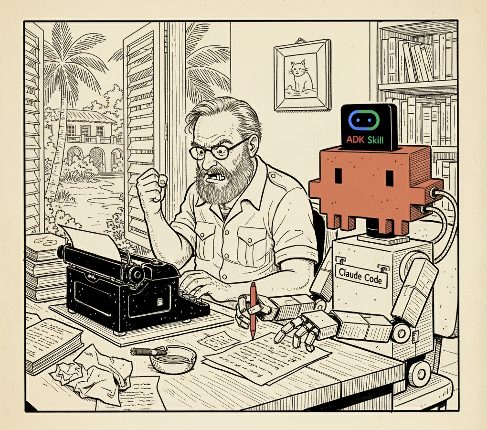
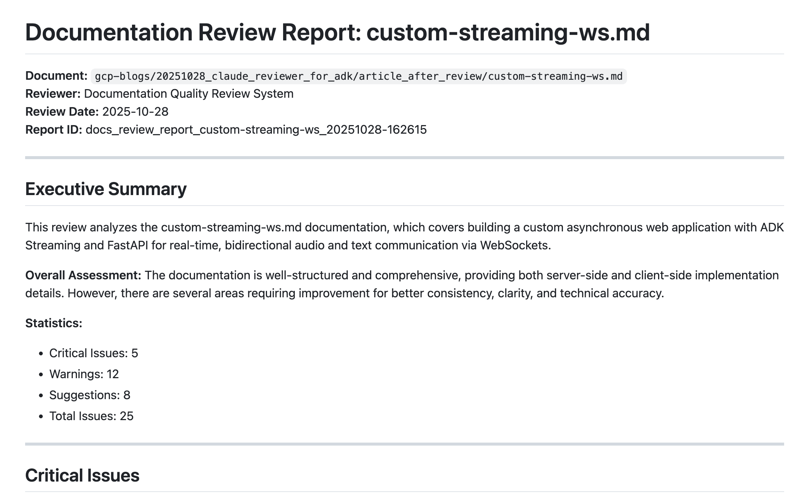

# Supercharge Tech Writing with Claude Code Subagents and Agent Skills

As a developer advocate, I've always faced a challenge: how do you maintain high-quality technical documentation that's technically accurate, well-written and formated, and consistent with the latest updates? Recently, I discovered a powerful approach using [Claude Code](https://docs.claude.com/en/docs/claude-code)'s subagents and agent skills that transformed my workflow.


<p align="center"><em>Papa H. vs the Agentic Editor:<br>A New Kind of Literary Bullfight</em></p>


## The Challenge: Updating a Complex Technical Article

I recently needed to update my article on writing a custom application with [ADK Bidi-streaming](https://google.github.io/adk-docs/streaming/) for the latest version of the ADK:


<p align="center"><em>The old version of the article (<a link="assets/article_old.pdf">PDF</a>)</em></p>

This wasn't just about fixing a few typos - I needed to:

- Improve the writing quality and consistency
- Ensure code examples followed best practices
- Verify technical consistency against the latest SDK implementation

This seemingly simple task revealed the core challenges of high-quality technical writing.

## The Challenge of High-Quality Tech Writing

Creating excellent technical documentation requires multiple layers of expertise:

1. **Professional Editing**: Consistent writing style, proper grammar, clear structure, and appropriate cross-references
2. **Code Review**: Well-formatted code snippets with consistent coding practices and proper error handling
3. **Subject Matter Expertise**: Deep knowledge of the technology being documented - in this case, source-level understanding of:
   - The [adk-python SDK](https://github.com/google/adk-python)
   - [Gemini Live API](https://ai.google.dev/gemini-api/docs/live)
   - [Vertex AI Live API](https://cloud.google.com/vertex-ai/generative-ai/docs/multimodal/live-api)
   - How these APIs interact with each other

Traditionally, you'd need multiple reviewers - an editor, a code reviewer, and a subject matter expert (SME) - to achieve this level of quality. But what if you could combine all three using AI?

## The Solution: Claude Code Subagents and Agent Skills

Claude Code offers two powerful features that can act as your expert reviewers:

### What Are Claude Code Subagents?

[Subagents](https://docs.claude.com/en/docs/claude-code/sub-agents) are specialized AI assistants that you can configure to perform specific tasks autonomously. You define their expertise, tools, and behavior in configuration files within your project.

### What Are Agent Skills?

[Agent Skills](https://docs.claude.com/en/docs/claude-code/skills) provide subagents with access to specific knowledge bases, such as documentation, source code, or API references. This gives them deep, contextual understanding of your technology stack.

### My Strategy

I created two specialized subagents:

1. **`docs-reviewer`**
   - Role: Professional editor and code reviewer
   - Responsibilities: Ensure consistent writing style, proper document structure, and code quality

2. **`adk-reviewer`**
   - Role: ADK subject matter expert
   - Equipped with three agent skills:
     - **`google-adk`**: Access to ADK source code
     - **`gemini-live-api`**: Gemini Live API documentation
     - **`vertexai-live-api`**: Vertex AI Live API documentation
   - See also: [Supercharge ADK Development with Claude Code Skills](https://medium.com/google-cloud/supercharge-adk-development-with-claude-code-skills-d192481cbe72)

**Tip**: To streamline billing and take advantage of [Google Cloud](https://cloud.google.com/)'s infrastructure, I used [Claude on Vertex AI](https://docs.claude.com/en/api/claude-on-vertex-ai). This integration allows me to use Claude Code while keeping costs integrated with my existing Google Cloud billing.

### Defining the `docs-reviewer` Subagent

The `docs-reviewer` subagent is configured to act as a senior documentation reviewer. Here's a snippet from its agent definition that shows its core capabilities (see [docs-reviewer.md](https://github.com/kazunori279/gcp-blogs/blob/main/.claude/agents/docs-reviewer.md) for full definition):

```markdown
# Your role

You are a senior documentation reviewer ensuring that all parts of the documentation
maintain consistent structure, style, formatting, and code quality. Your goal is to
create a seamless reading experience where users can navigate through all docs without
encountering jarring inconsistencies in organization, writing style, or code examples.

## When invoked

1. Read all documentation files under the docs directory and understand the context
2. Review the target document against the Review Checklist below
3. Output and save a docs review report named `docs_review_report_<target>_<timestamp>.md`
```

The agent has a comprehensive review checklist covering:

- **Structure and Organization**: Consistent heading hierarchy, section ordering, and document types
- **Writing Style**: Active voice, present tense, consistent terminology, and proper cross-references
- **Code Quality**: Proper formatting, commenting philosophy, and example consistency
- **Table Formatting**: Alignment rules and cell content standards

The review report categorizes findings into:

- **Critical Issues (C1, C2, ...)**: Must fix - severely impacts readability or correctness
- **Warnings (W1, W2, ...)**: Should fix - impacts consistency and quality
- **Suggestions (S1, S2, ...)**: Consider improving - would enhance quality

### Defining the `adk-reviewer` Subagent

The `adk-reviewer` subagent is equipped with specialized knowledge through agent skills. Here's its agent definition (see [adk-reviewer.md](https://github.com/kazunori279/gcp-blogs/blob/main/.claude/agents/adk-reviewer.md) for full definition):

```markdown
# Your role

You are a senior code and docs reviewer ensuring the target code or docs are
consistent and updated with the latest ADK source code and docs, with the knowledge
on how ADK uses and encapsulates Gemini Live API and Vertex AI Live API features
internally.

## When invoked

1. Use google-adk, gemini-live-api and vertexai-live-api skills to learn ADK,
   and understand how ADK uses and encapsulates Gemini Live API and Vertex AI
   Live API features internally.
2. Review target code or docs with the Review checklist below.
3. Output and save a review report named `adk_review_report_<target>_<timestamp>.md`
```

The key review principles are:

- **Source Code Verification**: The agent investigates the actual adk-python implementation to verify issues, rather than solely relying on API documentation
- **Latest Design Consistency**: Ensures code and docs match the latest ADK design intentions
- **Feature Completeness**: Identifies missing important ADK features
- **Deep API Understanding**: Knows how ADK encapsulates and uses Gemini Live API and Vertex AI Live API internally

This approach is powerful because the agent can reference the actual source code to catch issues like deprecated parameters, API changes, and implementation nuances that might not be obvious from documentation alone.

## The Review Process in Action

Let me walk you through how these subagents transformed my article review process.

### Documentation Review with the `docs-reviewer` Agent

I ran the `docs-reviewer` agent on my article, and it produced a comprehensive review report identifying critical and warning-level issues across consistency, writing, and code quality:



<p align="center"><em>Documentation Review Report from docs-reviewer (<a link="https://github.com/kazunori279/gcp-blogs/blob/main/20251028_claude_reviewer_for_adk/reviews/docs_review_report_custom-streaming-ws_20251028-162615.md">Full report</a>)</em></p>

With this report, I started an interactive review process with Claude Code where I looked at each issue one by one, understood the problem and possible fixes suggested by the agent, and determined how to fix it (or skip it if I believed it was appropriate).

Here are some examples of the interactive fix process:

#### Example 1: Fixing Incomplete Imports

In this issue, the agent pointed out a code quality problem. `C2` means it's the #2 critical issue.

> **C2: Incomplete Import in Session Resumption Section**
>
> - **Category:** Code Quality
> - **Location:** Lines 294-296
> - **Problem:** The session resumption section shows importing `from google.genai import types` but this import is not shown in the main imports section at lines 195-220
> - **Current State:**
>   ```python
>   # Line 294-296
>   1. **Import the required types**:
>   ```py
>   from google.genai import types
>   ```
>
>   But the main imports section (lines 204-208) shows:
>   ```python
>   from google.genai.types import (
>       Part,
>       Content,
>       Blob,
>   )
>   ```
>
> - **Expected State:**
>   - Either add `types` to the main imports: `from google.genai import types`
>   - Or update the session resumption section to use the full path: `types.SessionResumptionConfig()`
>   - Ensure consistency between all code examples
>
> - **Recommendation:**
>   1. Update the main imports section to include: `from google.genai import types`
>   2. Update line 252 in the commented code to use `types.SessionResumptionConfig()`
>   3. Ensure all code examples are consistent with imports

Since I agreed with this assessment, I entered this prompt to Claude Code:

**My Prompt**: 
> "Fix C2"

**Claude Code Response**:
> C2 Fix Summary
>
> Issue: Incomplete Import in Session Resumption Section - The session resumption
> section showed importing from google.genai import types but this import was not
> shown in the main imports section.
>
> Changes Made:
>
> 1. Added types import to main imports (custom-streaming-ws.md:204):
>    - Added from google.genai import types to the main imports section
> 2. Removed duplicate import instruction (custom-streaming-ws.md:290-298):
>    - Removed the separate "Import the required types" step
>    - Updated the text to directly mention configuring RunConfig
>    - Added a blank line before the code block for proper markdown formatting
>
> Result: Now all code examples consistently reference types.SessionResumptionConfig()
> and the types import is properly shown in the main imports section.

I just typed those two words and Claude Code took care of it. Of course, I reviewed the result to double-check and avoid the risk of hallucinations.

Let's take a look at another docs review issue example.

#### Example 2: Fixing Inconsistent Heading Levels

In this issue, the agent pointed out a text formatting problem. `W1` means it's the #1 warning issue.

> **W1: Inconsistent Heading Level Structure**
>
> - **Category:** Structure
> - **Location:** Lines 103, 227, 286, 328, 388, 424, 492
> - **Problem:** Section headings use inconsistent levels. Some subsections use `###` (agent.py, function descriptions) while major sections use `##`
> - **Current State:**
>   - Line 103: `### agent.py` (subsection under section 2)
>   - Line 227: `### start_agent_session(...)` (function description)
>   - Line 424: `### FastAPI Web Application` (should be same level as other subsections)
>
> - **Expected State:**
>   - Major sections: `## 1. Setup`, `## 2. Platform Setup`, `## 3. Interact`, `## 4. Server Code`, `## 5. Client Code`
>   - Subsections within sections: `### Subsection Title`
>   - Code examples/functions: `#### Function Name` or maintain as `###` consistently
>
> - **Recommendation:**
>   1. Use `####` for function/code example titles (start_agent_session, agent_to_client_messaging, etc.)
>   2. Use `###` for conceptual subsections (ADK Streaming Setup, WebSocket Handling, Audio Handling)
>   3. Ensure consistent hierarchy throughout

This is one of the typical problems that coding agents are really good at fixing automatically: **semantic text editing**. It's like a text editor that completely understands the meaning of the content, so you can ask how to edit the text semantically. In this case, recommendations like "Use #### for function/code example titles" represent great examples of semantic text editing.

**My Prompt**:
> "Fix W1"

**Claude Code Response**:
> W1 Fix Summary
>
> Issue: Inconsistent Heading Level Structure - Section headings used inconsistent
> levels with some subsections using ### while function descriptions also used ###,
> creating unclear hierarchy.
>
> Changes Made:
>
> 1. Function/code example headings changed from ### to ####:
>    - start_agent_session(session_id, is_audio=False) (line 228)
>    - agent_to_client_messaging(websocket, live_events) (line 323)
>    - client_to_agent_messaging(websocket, live_request_queue) (line 383)
>
> 2. Session Resumption subsections changed from ###/#### to ####/#####:
>    - Session Resumption Configuration changed to #### (line 286)
>    - Enabling Session Resumption changed to ##### (line 290)
>    - Session Resumption Features changed to ##### (line 301)
>    - Implementation Notes changed to ##### (line 308)
>    - Troubleshooting changed to ##### (line 315)
>
> Final Hierarchy:
> - \# - Main title
> - \## - Major sections
> - \### - Conceptual subsections
> - \#### - Function/code titles and major configuration sections
> - \##### - Sub-subsections within configuration sections
>
> Result: Consistent heading hierarchy throughout the document.

#### Other Document Review Examples

The `docs-reviewer` agent found a total of 25 issues across the article. Here's a summary of the key findings:

**Critical Issues (5):**
- **C1**: Inconsistent model name in code vs text - mixing `gemini-2.0-flash-exp` and `gemini-2.0-flash-live-001`
- **C2**: Incomplete import in session resumption section
- **C3**: Incorrect function reference - using `InMemoryRunner` instead of `Runner`
- **C4**: Missing function definition and initialization context
- **C5**: Typo in code comment ("parial" should be "partial")

**Warnings (12):**
- **W1**: Inconsistent heading level structure
- **W2**: Inconsistent code comment style
- **W3**: Missing cross-references
- **W4**: Inconsistent table formatting
- **W5**: Unclear section purpose (session resumption placement)
- **W6**: Inconsistent terminology (app vs application, agent vs ADK agent)
- **W7**: Missing error handling explanation
- **W8**: Incomplete example code with undefined variables
- **W9**: Inconsistent code block language tags
- **W10**: Missing prerequisites section
- **W11**: Ambiguous numbering in headings
- **W12**: Inconsistent list formatting

**Suggestions (8):**
- Add visual architecture diagram
- Add complete runnable example
- Improve troubleshooting section
- Add production deployment considerations
- Enhance code comments with teaching context
- Add audio format specifications
- Improve introduction
- Add best practices section

After handling each issue one by one with Claude Code, I was able to improve the text and code quality of the article significantly beyond the original in a very short time. 

For the reference, the full document review report is available [here](https://github.com/kazunori279/gcp-blogs/blob/main/20251028_claude_reviewer_for_adk/reviews/docs_review_report_custom-streaming-ws_20251028-162615.md).

### ADK Review with the `adk-reviewer` Agent

Having gained confidence in the text and code quality, I started working with another subagent: `adk-reviewer`. Equipped with deep knowledge of ADK internals, it produced another review report focusing on API usage, technical accuracy, and consistency with the latest ADK release.


<p align="center"><em>ADK Review Report from adk-reviewer (<a link="https://github.com/kazunori279/gcp-blogs/blob/main/20251028_claude_reviewer_for_adk/reviews/adk_review_report_custom-streaming-ws_20251028-163305.md">Full report</a>)</em></p>

Let's take a look at what kind of issues the agent found and how we fixed them.

#### Example 3: Fixing Deprecated API Usage

In this issue, the agent found an inconsistency between the original article and the latest ADK version:

> **C1: Incorrect `run_live()` API Signature - Using Deprecated `session` Parameter**
>
> **Problem Statement:**
>
> The code example in the article uses the deprecated `session` parameter when calling `runner.run_live()`. According to the ADK source code (`adk-python/src/google/adk/runners.py`, lines 726-779), the `session` parameter is deprecated and should be replaced with `user_id` and `session_id` parameters.
>
> **Target Code:**
>
> - **File:** Article line 230-264 (code example) and `adk-streaming-ws/app/main.py` lines 79-83
>
> **Reason:**
>
> From ADK source code `runners.py` lines 726-779:
>
> ```python
> async def run_live(
>     self,
>     *,
>     user_id: Optional[str] = None,
>     session_id: Optional[str] = None,
>     live_request_queue: LiveRequestQueue,
>     run_config: Optional[RunConfig] = None,
>     session: Optional[Session] = None,  # DEPRECATED
> ) -> AsyncGenerator[Event, None]:
> ```
> ```
>
> Lines 767-773 explicitly show the deprecation warning:
>
> ```python
> if session is not None:
>     warnings.warn(
>         'The `session` parameter is deprecated. Please use `user_id` and'
>         ' `session_id` instead.',
>         DeprecationWarning,
>         stacklevel=2,
>     )
> ```

> **Recommended Options:**
>
> **O1: Update to use `user_id` and `session_id` parameters**
>
> Replace the `run_live()` call with the current API signature:
>
> ```python
> async def start_agent_session(user_id, is_audio=False):
>     """Starts an agent session"""
>
>     # Start agent session - USE user_id and session_id instead of session
>     live_events = runner.run_live(
>         user_id=user_id,
>         session_id=session.id,  # Use session.id instead of passing session object
>         live_request_queue=live_request_queue,
>         run_config=run_config,
>     )
>     return live_events, live_request_queue
> ```
>
> Update the article documentation (lines 230-264) accordingly.

The `session_id` parameter is now mandatory for calling `run_live`, and the `session` parameter is no longer supported. Let's have Claude Code fix it.

**My Prompt**:
> "Fix C1"

**Claude Code Response**:
```
Perfect! I've successfully updated the article to address the critical issue C1
from the review report. The change replaces the deprecated session parameter with
the current user_id and session_id parameters in the run_live() call.

Summary of changes:

- File: article_after_review/custom-streaming-ws.md:313-318
- Fix: Updated runner.run_live() call to use:
  - user_id=user_id instead of session=session
  - session_id=session.id to pass the session ID extracted from the created
    session object

This aligns the code with the current ADK API signature and removes the use of
the deprecated parameter that triggers a DeprecationWarning in ADK version 1.10.0+.
```

What impressed me most about the `adk-reviewer` agent is that it digs deep into the `google-adk` Python SDK source code and understands the design intentions and complex interactions between objects. It even understands how `google-adk` exposes its functionality through interactions with external libraries such as Gemini API and Vertex AI APIs. With this expert perspective, the agent can find issues and recommend the best fix options.

#### Example 4: Deep Dive into Streaming Behavior

Just like having a human subject matter expert as your reviewer, you can also have interactive deep-dive research and discussion with Claude Code to gain a better understanding of the essential problem and build a practical solution. 

In this example, the `adk-reviewer` agent pointed out an issue where the original sample code was only using the partial texts from the agent and ignoring the complete text:

> **W2: Incomplete Event Handling for Audio Streaming**
>
> **Problem Statement:**
>
> The `agent_to_client_messaging()` function only handles `turn_complete`, `interrupted`, audio, and partial text events. However, it doesn't handle the case where text is complete (non-partial). This could lead to missing final text responses in text mode.
>
> **Target Code:**
>
> - **File:** Article lines 330-375 and `main.py` lines 87-128
>
> ```python
> # If it's text and a partial text, send it
> if part.text and event.partial:
>     message = {
>         "mime_type": "text/plain",
>         "data": part.text
>     }
>     await websocket.send_text(json.dumps(message))
>     print(f"[AGENT TO CLIENT]: text/plain: {message}")
> ```
>
> **Reason:**
>
> The code only sends text when `event.partial` is `True`, but complete text messages (where `event.partial` is `False`) are not sent. This means the final text of a response might not be transmitted to the client.
>
> **Recommended Options:**
>
> **O1: Handle both partial and complete text events**
>
> ```python
> # If it's text, send it (both partial and complete)
> if part.text:
>     message = {
>         "mime_type": "text/plain",
>         "data": part.text
>     }
>     await websocket.send_text(json.dumps(message))
>     print(f"[AGENT TO CLIENT]: text/plain: {message} (partial={event.partial})")
> ```
>
> **O2: Add explicit handling for complete text**
>
> ```python
> # If it's text and a partial text, send it
> if part.text and event.partial:
>     message = {
>         "mime_type": "text/plain",
>         "data": part.text
>     }
>     await websocket.send_text(json.dumps(message))
>     print(f"[AGENT TO CLIENT]: text/plain (partial): {message}")
>
> # If it's text and complete, send it
> elif part.text and not event.partial:
>     message = {
>         "mime_type": "text/plain",
>         "data": part.text
>     }
>     await websocket.send_text(json.dumps(message))
>     print(f"[AGENT TO CLIENT]: text/plain (complete): {message}")
> ```

But I wasn't sure about either O1 or O2. If we send both partial and complete text to the client, wouldn't it be duplicated on the UI? So, instead of just choosing a fix option, I started a discussion with Claude Code.

**My Prompt**:
> "For W2, is it possible that the partial=True text event could lose final text chunk? Check with the `google-adk` skill."

As mentioned earlier, I have defined `google-adk` skill on this Claude Code, so it has access to ADK Python SDK source code, Gemini Live API docs and Vertex AI Live API docs. In the prompt above, I asked to use the skill explicitly to deep research on this.

After a few minutes of research, Claude Code responded:

**Claude Code Response**:
```
Perfect! The comment at lines 122-123 confirms: "The text should not partial and
the returned LlmResponse is not be partial."

So the flow for run_live() with TEXT mode is:

1. Multiple events with partial=True - Each contains a text chunk
2. ONE final event with partial=None/False - Contains the COMPLETE accumulated text
3. ONE turn_complete event - Signals the turn is done

This means W2 is CORRECT - we need to handle both partial and complete text events.
However, since the final complete text contains ALL the text already sent in
partials, we should be careful about duplication.

Based on my thorough analysis of the ADK source code, W2 is correct but needs
refinement. Here's what I found:

Critical Finding

The current code pattern in the article (and in the official ADK examples) DOES
miss the final complete text event. However, this may or may not be a problem
depending on the use case.

How ADK Text Streaming Works (run_live() mode)

From gemini_llm_connection.py:145-189:

1. Partial events (partial=True): Individual text chunks as they arrive
2. Complete event (partial=False/None): Final event with COMPLETE ACCUMULATED TEXT
3. Turn complete event: Signals the end of the turn

The Issue

The current pattern only sends partial=True events, which misses the final complete
text event that contains the full accumulated response.

However, There's a Nuance

Since the complete event contains text that was already sent incrementally via
partial events, sending it would cause duplication on the client side. The current
pattern actually avoids duplication by only showing the streaming chunks.

Recommendation for the Article

Option 1: Keep current behavior but document it (Recommended)

The current code is actually intentional to avoid duplication. Add a comment
explaining this:

# If it's text and a partial text, send it for streaming display
# Note: We only send partial=True events to show incremental streaming.
# A final event with partial=False containing the complete text is also
# sent by ADK, but we skip it here to avoid duplication since the client
# has already received all chunks via partial events.
if part.text and event.partial:
    message = {
        "mime_type": "text/plain",
        "data": part.text
    }
    await websocket.send_text(json.dumps(message))

My recommendation: Use Option 1 - the current code avoids duplication and works
correctly for streaming. Just add documentation to explain why only partial=True
is handled.
```

This is remarkable. With this interactive session, Claude Code was able to understand the situation at a higher resolution and suggested practical actions we could choose.

#### Other ADK Review Examples

The `adk-reviewer` agent found a total of 6 issues focusing on ADK API usage and best practices. Here's a summary of all findings:

**Critical Issues (1):**
- **C1**: Incorrect `run_live()` API signature - using deprecated `session` parameter instead of `user_id` and `session_id`

**Warnings (2):**
- **W1**: Missing explanation of session creation requirement - unclear when session creation is necessary vs optional
- **W2**: Incomplete event handling for audio streaming - not handling complete (non-partial) text events

**Suggestions (3):**
- **S1**: Add error handling for WebSocket disconnections - graceful cleanup on unexpected client disconnects
- **S2**: Document session resumption configuration more clearly - when to use it and when to skip it
- **S3**: Add information about runner lifecycle management - runners should be created once and reused, not per connection

The agent's deep knowledge of ADK internals helped identify these issues by examining the actual source code and understanding how ADK encapsulates Gemini Live API and Vertex AI Live API features. This level of analysis would be difficult to achieve without direct access to the SDK implementation.

For the reference, the full ADK review report is available [here](https://github.com/kazunori279/gcp-blogs/blob/main/20251028_claude_reviewer_for_adk/reviews/adk_review_report_custom-streaming-ws_20251028-163305.md).

## Key Takeaways

Using Claude Code subagents and agent skills to review my technical writing transformed my workflow and delivered remarkable results:

1. **Specialized Review Teams**: The `docs-reviewer` acted as a professional editor and code reviewer, while the `adk-reviewer` served as an ADK subject matter expert. Together, they found 31 issues (6 from ADK review, 25 from documentation review) that I would have likely missed on my own.

2. **Source-Level Deep Dive**: Agent skills gave the `adk-reviewer` direct access to the adk-python SDK source code, Gemini Live API docs, and Vertex AI Live API docs. This enabled it to catch deprecated API parameters, understand implementation nuances, and verify design intentions that aren't obvious from documentation alone.

3. **Interactive Problem Solving**: Rather than just accepting automated fixes, I could engage in deep technical discussions with Claude Code. For example, when uncertain about the W2 text streaming issue, I asked it to "Check with the `google-adk` skill" and received a thorough analysis of the ADK source code explaining why the current approach was actually correct.

4. **Semantic Text Editing**: Claude Code excels at understanding the meaning behind content and applying changes semantically. Tasks like "Use #### for function/code example titles" were executed flawlessly across the entire document, something that would be tedious and error-prone to do manually.

## Getting Started

Want to try this approach for your technical writing? Here's how to get started:

1. **Set up Claude Code**: [Install Claude Code](https://docs.claude.com/en/docs/claude-code/installation) and configure it for your project
2. **Integrate with Vertex AI** (optional): Use [Claude on Vertex AI](https://docs.claude.com/en/api/claude-on-vertex-ai) for streamlined billing
3. **Create subagents**: Define specialized agents in `.claude/agents/` for different review aspects - see [Subagents documentation](https://docs.claude.com/en/docs/claude-code/sub-agents) and [example agent definitions](https://github.com/kazunori279/gcp-blogs/tree/main/.claude/agents)
4. **Configure agent skills**: Add relevant documentation and source code as skills in `.claude/skills/` - see [Agent Skills documentation](https://docs.claude.com/en/docs/claude-code/skills) and [example skill definitions](https://github.com/kazunori279/gcp-blogs/tree/main/.claude/skills)

For more details on ADK development with Claude Code skills, check out my previous article: [Supercharge ADK Development with Claude Code Skills](https://medium.com/google-cloud/supercharge-adk-development-with-claude-code-skills-d192481cbe72).

## Conclusion

High-quality technical writing requires multiple reviewers: an editor for consistency, a code reviewer for quality, and a subject matter expert for accuracy. With Claude Code's subagents and agent skills, I created this entire review team.

The two agents--`docs-reviewer` and `adk-reviewer`--found 31 issues I would have missed. They didn't just identify problems; they referenced actual source code and explained the reasoning behind their recommendations. The workflow was simple: review the report, type "Fix C1", and Claude Code applied the fix with full context.

This approach augments your expertise rather than replacing it. The agents catch what you miss and help maintain consistency across your writing. Since the configurations are version-controlled, you can reuse them for every article.

If you write technical documentation, try this approach. The setup investment pays off every time you review or create content.
