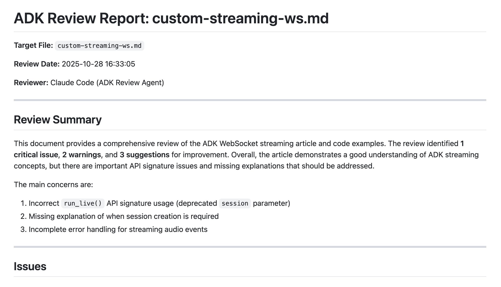

# Claude Code のサブエージェントとスキルで技術ドキュメント執筆を強化する

デベロッパーアドボケイトとして、私は常にある課題に直面してきました。技術的に正確で、文章も整っており、最新の更新と一貫性のある高品質な技術ドキュメントをどう維持するか？最近、[Claude Code](https://docs.claude.com/en/docs/claude-code) のサブエージェントとエージェントスキルを使った強力なアプローチを発見し、ワークフローが一変しました。


<p align="center"><em>パパ・H vs エージェンティック・エディター：<br>新しい文学的闘牛</em></p>

## 課題：複雑な技術記事の更新

最近、私が以前執筆した [ADK 公式ドキュメントサイト](https://google.github.io/adk-docs/)上の記事 [Custom audio streaming app with ADK Bidi-streaming](https://google.github.io/adk-docs/streaming/custom-streaming-ws/) を更新する必要がありました：


<p align="center"><em>記事: <a link="https://google.github.io/adk-docs/streaming/custom-streaming-ws/">Custom audio streaming app with ADK Bidi-streaming</a></em></p>

これは単なる誤字修正ではありませんでした。私がやりたかったのは：

- 文章の質と一貫性を改善する
- コード例がベストプラクティスに従っているか確認する
- 最新の SDK 実装に対する技術的一貫性を検証する

この一見シンプルなタスクが、高品質な技術ドキュメント執筆の核心的な課題を浮き彫りにしました。

## 高品質な技術ドキュメント執筆の課題

優れた技術ドキュメントを作成するには、複数のレイヤーの専門知識が必要です：

1. **プロフェッショナルな編集**: 一貫した文体、適切な文法、明確な構造、適切なクロスリファレンス
2. **コードレビュー**: 一貫したコーディング規約と適切なエラーハンドリングを備えた整形されたコードスニペット
3. **主題の専門知識**: ドキュメント化する技術に関する深い知識 - この場合、以下のソースレベルの理解：
   - [adk-python SDK](https://github.com/google/adk-python)
   - [Gemini Live API](https://ai.google.dev/gemini-api/docs/live)
   - [Vertex AI Live API](https://cloud.google.com/vertex-ai/generative-ai/docs/multimodal/live-api)
   - これらの API がどのように相互作用するか

従来は、このレベルの品質を達成するために複数のレビュアー（編集者、コードレビュアー、主題の専門家（SME））が必要でした。しかし、AI を使ってこれら3つを組み合わせることができたらどうでしょうか？

## ソリューション：Claude Code のサブエージェントとエージェントスキル

Claude Code には、専門的なレビュアーとして機能できる2つの強力な機能があります：

### Claude Code サブエージェントとは？

[サブエージェント](https://docs.claude.com/en/docs/claude-code/sub-agents)は、特定のタスクを自律的に実行するように設定できる専門的な AI アシスタントです。プロジェクト内の設定ファイルで、その専門知識、ツール、動作を定義します。

### エージェントスキルとは？

[エージェントスキル](https://docs.claude.com/en/docs/claude-code/skills)は、ドキュメント、ソースコード、API リファレンスなどの特定の知識ベースへのアクセスをサブエージェントに提供します。これにより、技術スタックに対する深いコンテキストの理解が得られます。

### 私の戦略

2つの専門的なサブエージェントを作成しました：

1. **`docs-reviewer`**
   - 役割：プロフェッショナルな編集者とコードレビュアー
   - 責任：一貫した文体、適切なドキュメント構造、コード品質を確保

2. **`adk-reviewer`**
   - 役割：ADK 主題の専門家
   - 3つのエージェントスキルを装備：
     - **`google-adk`**: ADK ソースコードへのアクセス
     - **`gemini-live-api`**: Gemini Live API ドキュメント
     - **`vertexai-live-api`**: Vertex AI Live API ドキュメント
   - 参照：[Supercharge ADK Development with Claude Code Skills](https://medium.com/google-cloud/supercharge-adk-development-with-claude-code-skills-d192481cbe72)

**ヒント**: 請求を効率化し、[Google Cloud](https://cloud.google.com/) のインフラを活用するために、[Claude on Vertex AI](https://docs.claude.com/en/api/claude-on-vertex-ai) を使用しました。この統合により、既存の Google Cloud 請求と統合しながら Claude Code を使用できます。

### `docs-reviewer` サブエージェントの定義

`docs-reviewer` サブエージェントは、シニアドキュメントレビュアーとして機能するように設定されています。以下はそのコア機能を示すエージェント定義の抜粋です（完全な定義は [docs-reviewer.md](https://github.com/kazunori279/gcp-blogs/blob/main/.claude/agents/docs-reviewer.md) を参照）：

```markdown
# Your role

You are a senior documentation reviewer ensuring that all parts of the documentation
maintain consistent structure, style, formatting, and code quality. Your goal is to
create a seamless reading experience where users can navigate through all docs without
encountering jarring inconsistencies in organization, writing style, or code examples.

## When invoked

1. Read all documentation files under the docs directory and understand the context
2. Review the target document against the Review Checklist below
3. Output and save a docs review report named `docs_review_report_<target>_<timestamp>.md`
```

このエージェントには以下をカバーする包括的なレビューチェックリストがあります：

- **構造と組織**: 一貫した見出し階層、セクション順序、ドキュメントタイプ
- **文体**: 能動態、現在時制、一貫した用語、適切なクロスリファレンス
- **コード品質**: 適切なフォーマット、コメントの哲学、例の一貫性
- **テーブルフォーマット**: 配置ルールとセル内容の標準

レビューレポートは発見事項を以下のように分類します：

- **重大な問題 (C1, C2, ...)**: 必須修正 - 可読性や正確性に深刻な影響
- **警告 (W1, W2, ...)**: 修正すべき - 一貫性と品質に影響
- **提案 (S1, S2, ...)**: 改善を検討 - 品質を向上させる

### `adk-reviewer` サブエージェントの定義

`adk-reviewer` サブエージェントは、エージェントスキルを通じて専門知識を装備しています。以下はそのエージェント定義です（完全な定義は [adk-reviewer.md](https://github.com/kazunori279/gcp-blogs/blob/main/.claude/agents/adk-reviewer.md) を参照）：

```markdown
# Your role

You are a senior code and docs reviewer ensuring the target code or docs are
consistent and updated with the latest ADK source code and docs, with the knowledge
on how ADK uses and encapsulates Gemini Live API and Vertex AI Live API features
internally.

## When invoked

1. Use google-adk, gemini-live-api and vertexai-live-api skills to learn ADK,
   and understand how ADK uses and encapsulates Gemini Live API and Vertex AI
   Live API features internally.
2. Review target code or docs with the Review checklist below.
3. Output and save a review report named `adk_review_report_<target>_<timestamp>.md`
```

主要なレビュー原則は以下のとおりです：

- **ソースコード検証**: エージェントは API ドキュメントだけに頼らず、実際の adk-python 実装を調査して問題を検証
- **最新設計との一貫性**: コードとドキュメントが最新の ADK 設計意図と一致していることを確認
- **機能の完全性**: 重要な ADK 機能の欠落を特定
- **深い API 理解**: ADK が Gemini Live API と Vertex AI Live API を内部的にどうカプセル化して使用しているかを把握

このアプローチが強力なのは、エージェントが実際のソースコードを参照して、非推奨パラメータ、API 変更、ドキュメントだけでは明らかでない実装のニュアンスなどの問題をキャッチできるためです。

## レビュープロセスの実際

これらのサブエージェントが私の記事レビュープロセスをどのように変革したかを説明します。

### `docs-reviewer` エージェントによるドキュメントレビュー

記事に対して `docs-reviewer` エージェントを実行したところ、一貫性、文章、コード品質にわたって重大および警告レベルの問題を特定する包括的なレビューレポートが生成されました：


<p align="center"><em>docs-reviewer からのドキュメントレビューレポート (<a link="https://github.com/kazunori279/gcp-blogs/blob/main/20251028_claude_reviewer_for_adk/reviews/docs_review_report_custom-streaming-ws_20251028-162615.md">完全なレポート</a>)</em></p>

このレポートを基に、Claude Code とのインタラクティブなレビュープロセスを開始しました。各問題を一つずつ確認し、問題とエージェントが提案する可能な修正を理解し、修正方法を決定しました（適切だと判断した場合はスキップ）。

以下はインタラクティブな修正プロセスの例です：

#### 例 1: 不完全なインポートの修正

この問題では、エージェントがコード品質の問題を指摘しました。`C2` は #2 の重大な問題を意味します。

> **C2: Session Resumption セクションの不完全なインポート**
>
> - **カテゴリ:** コード品質
> - **場所:** 294-296行目
> - **問題:** Session Resumption セクションで `from google.genai import types` をインポートしていますが、このインポートは 195-220 行目のメインインポートセクションに表示されていません
> - **現状:**
>   ```python
>   # Line 294-296
>   1. **Import the required types**:
>   ```py
>   from google.genai import types
>   ```
>
>   しかしメインインポートセクション（204-208行目）では：
>   ```python
>   from google.genai.types import (
>       Part,
>       Content,
>       Blob,
>   )
>   ```
>
> - **期待される状態:**
>   - メインインポートに `types` を追加：`from google.genai import types`
>   - または Session Resumption セクションをフルパスに更新：`types.SessionResumptionConfig()`
>   - すべてのコード例間で一貫性を確保
>
> - **推奨:**
>   1. メインインポートセクションを更新して含める：`from google.genai import types`
>   2. 252行目のコメントコードを `types.SessionResumptionConfig()` を使用するよう更新
>   3. すべてのコード例がインポートと一貫していることを確認

この評価に同意したので、Claude Code に以下のプロンプトを入力しました：

**私のプロンプト**:
> "Fix C2"

**Claude Code の応答**:
> C2 修正サマリー
>
> 問題: Session Resumption セクションの不完全なインポート - Session Resumption
> セクションで from google.genai import types のインポートを表示していましたが、
> このインポートはメインインポートセクションに表示されていませんでした。
>
> 変更内容:
>
> 1. メインインポートに types インポートを追加 (custom-streaming-ws.md:204):
>    - メインインポートセクションに from google.genai import types を追加
> 2. 重複するインポート指示を削除 (custom-streaming-ws.md:290-298):
>    - 別個の「必要な型をインポート」ステップを削除
>    - テキストを更新して RunConfig の設定を直接言及
>    - 適切な markdown フォーマットのためコードブロック前に空行を追加
>
> 結果: すべてのコード例が types.SessionResumptionConfig() を一貫して参照し、
> types インポートがメインインポートセクションに適切に表示されるようになりました。

たった2語を入力するだけで、Claude Code が対処してくれました。もちろん、ハルシネーションのリスクを避けるため結果を再確認しました。

別のドキュメントレビュー問題の例を見てみましょう。

#### 例 2: 一貫性のない見出しレベルの修正

この問題では、エージェントがテキストフォーマットの問題を指摘しました。`W1` は #1 の警告問題を意味します。

> **W1: 一貫性のない見出しレベル構造**
>
> - **カテゴリ:** 構造
> - **場所:** 103, 227, 286, 328, 388, 424, 492 行目
> - **問題:** セクション見出しが一貫性のないレベルを使用。一部のサブセクションは `###`（agent.py、関数説明）を使用し、主要セクションは `##` を使用
> - **現状:**
>   - 103行目: `### agent.py`（セクション2下のサブセクション）
>   - 227行目: `### start_agent_session(...)`（関数説明）
>   - 424行目: `### FastAPI Web Application`（他のサブセクションと同じレベルであるべき）
>
> - **期待される状態:**
>   - 主要セクション: `## 1. Setup`, `## 2. Platform Setup`, `## 3. Interact`, `## 4. Server Code`, `## 5. Client Code`
>   - セクション内のサブセクション: `### Subsection Title`
>   - コード例/関数: `#### Function Name` または `###` を一貫して維持
>
> - **推奨:**
>   1. 関数/コード例タイトルには `####` を使用（start_agent_session, agent_to_client_messaging など）
>   2. 概念的サブセクションには `###` を使用（ADK Streaming Setup, WebSocket Handling, Audio Handling）
>   3. 全体を通じて一貫した階層を確保

これはコーディングエージェントが自動修正に本当に優れている典型的な問題です：**セマンティックテキスト編集**。コンテンツの意味を完全に理解するテキストエディタのようなもので、セマンティックにテキストをどう編集するかを尋ねることができます。この場合、「関数/コード例タイトルには #### を使用」のような推奨はセマンティックテキスト編集の素晴らしい例です。

**私のプロンプト**:
> "Fix W1"

**Claude Code の応答**:
> W1 修正サマリー
>
> 問題: 一貫性のない見出しレベル構造 - セクション見出しが一貫性のないレベルを
> 使用し、一部のサブセクションが ### を使用する一方で関数説明も ### を使用し、
> 不明確な階層を作成していました。
>
> 変更内容:
>
> 1. 関数/コード例見出しを ### から #### に変更:
>    - start_agent_session(session_id, is_audio=False)（228行目）
>    - agent_to_client_messaging(websocket, live_events)（323行目）
>    - client_to_agent_messaging(websocket, live_request_queue)（383行目）
>
> 2. Session Resumption サブセクションを ###/#### から ####/##### に変更:
>    - Session Resumption Configuration を #### に変更（286行目）
>    - Enabling Session Resumption を ##### に変更（290行目）
>    - Session Resumption Features を ##### に変更（301行目）
>    - Implementation Notes を ##### に変更（308行目）
>    - Troubleshooting を ##### に変更（315行目）
>
> 最終階層:
> - \# - メインタイトル
> - \## - 主要セクション
> - \### - 概念的サブセクション
> - \#### - 関数/コードタイトルと主要設定セクション
> - \##### - 設定セクション内のサブサブセクション
>
> 結果: ドキュメント全体で一貫した見出し階層。

#### その他のドキュメントレビュー例

`docs-reviewer` エージェントは記事全体で合計25件の問題を発見しました。主な発見のサマリーは以下のとおりです：

**重大な問題 (5件):**
- **C1**: コードとテキストで一貫性のないモデル名 - `gemini-2.0-flash-exp` と `gemini-2.0-flash-live-001` の混在
- **C2**: Session Resumption セクションの不完全なインポート
- **C3**: 不正確な関数参照 - `Runner` の代わりに `InMemoryRunner` を使用
- **C4**: 関数定義と初期化コンテキストの欠落
- **C5**: コードコメントの誤字（"parial" は "partial" であるべき）

**警告 (12件):**
- **W1**: 一貫性のない見出しレベル構造
- **W2**: 一貫性のないコードコメントスタイル
- **W3**: クロスリファレンスの欠落
- **W4**: 一貫性のないテーブルフォーマット
- **W5**: 不明確なセクション目的（Session Resumption の配置）
- **W6**: 一貫性のない用語（app vs application、agent vs ADK agent）
- **W7**: エラーハンドリング説明の欠落
- **W8**: 未定義変数を含む不完全なサンプルコード
- **W9**: 一貫性のないコードブロック言語タグ
- **W10**: 前提条件セクションの欠落
- **W11**: 見出しの曖昧な番号付け
- **W12**: 一貫性のないリストフォーマット

**提案 (8件):**
- ビジュアルアーキテクチャ図の追加
- 完全な実行可能サンプルの追加
- トラブルシューティングセクションの改善
- 本番デプロイメントの考慮事項の追加
- 教育的コンテキストを含むコードコメントの強化
- オーディオフォーマット仕様の追加
- 導入部の改善
- ベストプラクティスセクションの追加

Claude Code で各問題を一つずつ処理した結果、非常に短時間でオリジナルを大幅に超える記事のテキストとコード品質を改善できました。

参考として、完全なドキュメントレビューレポートは[こちら](https://github.com/kazunori279/gcp-blogs/blob/main/20251028_claude_reviewer_for_adk/reviews/docs_review_report_custom-streaming-ws_20251028-162615.md)で利用可能です。

### `adk-reviewer` エージェントによる ADK レビュー

テキストとコード品質に自信を得た後、別のサブエージェント `adk-reviewer` での作業を開始しました。ADK 内部の深い知識を装備したこのエージェントは、API 使用法、技術的正確性、最新 ADK リリースとの一貫性に焦点を当てた別のレビューレポートを生成しました。



<p align="center"><em>adk-reviewer からの ADK レビューレポート (<a link="https://github.com/kazunori279/gcp-blogs/blob/main/20251028_claude_reviewer_for_adk/reviews/adk_review_report_custom-streaming-ws_20251028-163305.md">完全なレポート</a>)</em></p>

エージェントが発見した問題の種類とその修正方法を見てみましょう。

#### 例 3: 非推奨 API 使用の修正

この問題では、エージェントがオリジナル記事と最新 ADK バージョン間の不整合を発見しました：

> **C1: 不正確な `run_live()` API シグネチャ - 非推奨の `session` パラメータを使用**
>
> **問題の説明:**
>
> 記事のコード例では、`runner.run_live()` 呼び出し時に非推奨の `session` パラメータを使用しています。ADK ソースコード（`adk-python/src/google/adk/runners.py`、726-779行目）によると、`session` パラメータは非推奨であり、`user_id` と `session_id` パラメータに置き換える必要があります。
>
> **対象コード:**
>
> - **ファイル:** 記事 230-264行目（コード例）および `adk-streaming-ws/app/main.py` 79-83行目
>
> **理由:**
>
> ADK ソースコード `runners.py` 726-779行目より：
>
> ```python
> async def run_live(
>     self,
>     *,
>     user_id: Optional[str] = None,
>     session_id: Optional[str] = None,
>     live_request_queue: LiveRequestQueue,
>     run_config: Optional[RunConfig] = None,
>     session: Optional[Session] = None,  # DEPRECATED
> ) -> AsyncGenerator[Event, None]:
> ```
>
> 767-773行目は明示的に非推奨警告を示しています：
>
> ```python
> if session is not None:
>     warnings.warn(
>         'The `session` parameter is deprecated. Please use `user_id` and'
>         ' `session_id` instead.',
>         DeprecationWarning,
>         stacklevel=2,
>     )
> ```

> **推奨オプション:**
>
> **O1: `user_id` と `session_id` パラメータを使用するよう更新**
>
> `run_live()` 呼び出しを現在の API シグネチャに置き換え：
>
> ```python
> async def start_agent_session(user_id, is_audio=False):
>     """Starts an agent session"""
>
>     # Start agent session - USE user_id and session_id instead of session
>     live_events = runner.run_live(
>         user_id=user_id,
>         session_id=session.id,  # Use session.id instead of passing session object
>         live_request_queue=live_request_queue,
>         run_config=run_config,
>     )
>     return live_events, live_request_queue
> ```
>
> 記事のドキュメント（230-264行目）もそれに応じて更新。

`session_id` パラメータは現在 `run_live` 呼び出しに必須であり、`session` パラメータはサポートされなくなりました。Claude Code に修正させましょう。

**私のプロンプト**:
> "Fix C1"

**Claude Code の応答**:
```
完璧です！レビューレポートの重大な問題 C1 に対処するため記事を正常に更新しました。
この変更は run_live() 呼び出しで非推奨の session パラメータを現在の user_id と
session_id パラメータに置き換えます。

変更のサマリー:

- ファイル: article_after_review/custom-streaming-ws.md:313-318
- 修正: runner.run_live() 呼び出しを以下を使用するよう更新：
  - session=session の代わりに user_id=user_id
  - 作成されたセッションオブジェクトからセッション ID を渡すための session_id=session.id

これにより、コードは現在の ADK API シグネチャと整合し、ADK バージョン 1.10.0+ で
DeprecationWarning をトリガーする非推奨パラメータの使用を削除します。
```

`adk-reviewer` エージェントで最も感銘を受けたのは、`google-adk` Python SDK ソースコードを深く掘り下げ、設計意図とオブジェクト間の複雑な相互作用を理解することです。Gemini API や Vertex AI API などの外部ライブラリとの相互作用を通じて `google-adk` がどのように機能を公開しているかさえ理解しています。このエキスパートの視点により、エージェントは問題を見つけ、最適な修正オプションを推奨できます。

#### 例 4: ストリーミング動作の深掘り

人間の主題専門家をレビュアーとして持つのと同様に、Claude Code とのインタラクティブな深掘り調査と議論により、本質的な問題をより深く理解し、実用的なソリューションを構築できます。

この例では、`adk-reviewer` エージェントがオリジナルのサンプルコードがエージェントからの部分的（増分）テキストのみを使用し、完全なテキストを無視している問題を指摘しました：

> **W2: オーディオストリーミングの不完全なイベントハンドリング**
>
> **問題の説明:**
>
> `agent_to_client_messaging()` 関数は `turn_complete`、`interrupted`、オーディオ、部分テキストイベントのみを処理します。しかし、テキストが完全（非部分）な場合を処理していません。これにより、テキストモードで最終テキスト応答が欠落する可能性があります。
>
> **対象コード:**
>
> - **ファイル:** 記事 330-375行目および `main.py` 87-128行目
>
> ```python
> # If it's text and a partial text, send it
> if part.text and event.partial:
>     message = {
>         "mime_type": "text/plain",
>         "data": part.text
>     }
>     await websocket.send_text(json.dumps(message))
>     print(f"[AGENT TO CLIENT]: text/plain: {message}")
> ```
>
> **理由:**
>
> コードは `event.partial` が `True` の場合にのみテキストを送信しますが、完全なテキストメッセージ（`event.partial` が `False`）は送信されません。これは応答の最終テキストがクライアントに送信されない可能性があることを意味します。

しかし、これについて確信が持てませんでした。部分テキストと完全テキストの両方をクライアントに送信すると、クライアントはそれらの間の重複を処理する必要があります。しかし同時に、エージェントからのテキストを失いたくありません。そこで、修正オプションを選ぶだけでなく、Claude Code との議論を開始しました。

**私のプロンプト**:
> "W2 について、partial=True のテキストイベントが最終テキストチャンクを失う可能性はありますか？`google-adk` スキルで確認してください。"

前述のとおり、この Claude Code には `google-adk` スキルを定義しているため、ADK Python SDK ソースコード、Gemini Live API ドキュメント、Vertex AI Live API ドキュメントにアクセスできます。上記のプロンプトでは、これについて深く調査するためスキルを明示的に使用するよう依頼しました。

数分間の調査後、Claude Code は応答しました：

**Claude Code の応答**:

```text
はい、partial=True のすべてのテキストを連結すると、partial=False（または partial フィールドなし）
の最終集約応答とまったく同じテキストが得られます。

adk-python/src/google/adk/utils/streaming_utils.py によると、以下のように動作します：

1. 部分応答 (partial=True): テキストをストリーミングする際、各チャンクは内部バッファ
（61-63行目の self._text と self._thought_text）に蓄積されます：

   if part0.thought:
      self._thought_text += part0.text
   else:
      self._text += part0.text
   llm_response.partial = True

2. 最終集約応答 (partial なし または partial=False): ストリームが完了するか非テキスト
イベントに遭遇すると、アグリゲーターはすべての蓄積テキストを含む応答を生成します（71-79行目）：

   parts = []
   if self._thought_text:
      parts.append(types.Part(text=self._thought_text, thought=True))
   if self._text:
      parts.append(types.Part.from_text(text=self._text))
   yield LlmResponse(
      content=types.ModelContent(parts=parts),
      usage_metadata=llm_response.usage_metadata,
   )

最終応答は単にすべての部分テキストチャンクの連結です。変更、フォーマット、
追加の処理はありません - 直接的な文字列蓄積です。
```

これで、ADK ソースコードレベルで部分テキストがエージェントからのテキストを失わないことを確認しました。

これは驚くべきことです。このインタラクティブセッションにより、Claude Code は状況をより高い解像度で理解し、より深いインタラクティブなレビュープロセスを提供できました。

#### その他の ADK レビュー例

`adk-reviewer` エージェントは ADK API 使用法とベストプラクティスに焦点を当てた合計6件の問題を発見しました。すべての発見のサマリーは以下のとおりです：

**重大な問題 (1件):**
- **C1**: 不正確な `run_live()` API シグネチャ - `user_id` と `session_id` の代わりに非推奨の `session` パラメータを使用

**警告 (2件):**
- **W1**: セッション作成要件の説明欠落 - セッション作成が必要な場合とオプションの場合が不明確
- **W2**: オーディオストリーミングの不完全なイベントハンドリング - 完全な（非部分）テキストイベントを処理していない

**提案 (3件):**
- **S1**: WebSocket 切断のエラーハンドリング追加 - 予期しないクライアント切断時の優雅なクリーンアップ
- **S2**: セッション再開設定をより明確にドキュメント化 - いつ使用すべきか、いつスキップすべきか
- **S3**: ランナーライフサイクル管理に関する情報追加 - ランナーは一度作成して再利用すべきで、接続ごとに作成すべきではない

エージェントの ADK 内部に関する深い知識は、実際のソースコードを調査し、ADK が Gemini Live API と Vertex AI Live API 機能をどうカプセル化しているかを理解することで、これらの問題を特定するのに役立ちました。このレベルの分析は、SDK 実装への直接アクセスなしでは達成困難です。

参考として、完全な ADK レビューレポートは[こちら](https://github.com/kazunori279/gcp-blogs/blob/main/20251028_claude_reviewer_for_adk/reviews/adk_review_report_custom-streaming-ws_20251028-163305.md)で利用可能です。

## 重要なポイント

Claude Code のサブエージェントとエージェントスキルを使用して技術ドキュメントをレビューすることで、ワークフローが変革し、顕著な結果が得られました：

1. **専門レビューチーム**: `docs-reviewer` はプロフェッショナルな編集者とコードレビュアーとして機能し、`adk-reviewer` は ADK 主題専門家として機能しました。合わせて、自分だけでは見逃していたであろう31件の問題（ADK レビューから6件、ドキュメントレビューから25件）を発見しました。

2. **ソースレベルの深掘り**: エージェントスキルにより `adk-reviewer` は adk-python SDK ソースコード、Gemini Live API ドキュメント、Vertex AI Live API ドキュメントに直接アクセスできました。これにより、非推奨 API パラメータをキャッチし、実装のニュアンスを理解し、ドキュメントだけでは明らかでない設計意図を検証できました。

3. **インタラクティブな問題解決**: 自動修正を単に受け入れるのではなく、Claude Code と深い技術的議論を行うことができました。例えば、W2 テキストストリーミングの問題について不確かな場合、「`google-adk` スキルで確認して」と依頼し、現在のアプローチが実際に正しい理由を説明する ADK ソースコードの徹底的な分析を受け取りました。

4. **セマンティックテキスト編集**: Claude Code はコンテンツの背後にある意味を理解し、セマンティックに変更を適用することに優れています。「関数/コード例タイトルには #### を使用」のようなタスクはドキュメント全体で完璧に実行されました。これは手動で行うと退屈でエラーが発生しやすいものです。

## 始め方

技術ドキュメント執筆にこのアプローチを試したいですか？始め方は以下のとおりです：

1. **Claude Code のセットアップ**: [Claude Code をインストール](https://docs.claude.com/en/docs/claude-code/installation)してプロジェクト用に設定
2. **Vertex AI との統合**（オプション）: 請求を効率化するため [Claude on Vertex AI](https://docs.claude.com/en/api/claude-on-vertex-ai) を使用
3. **サブエージェントの作成**: `.claude/agents/` に様々なレビュー側面のための専門エージェントを定義 - [サブエージェントドキュメント](https://docs.claude.com/en/docs/claude-code/sub-agents)と[サンプルエージェント定義](https://github.com/kazunori279/gcp-blogs/tree/main/.claude/agents)を参照
4. **エージェントスキルの設定**: `.claude/skills/` に関連するドキュメントとソースコードをスキルとして追加 - [エージェントスキルドキュメント](https://docs.claude.com/en/docs/claude-code/skills)と[サンプルスキル定義](https://github.com/kazunori279/gcp-blogs/tree/main/.claude/skills)を参照

Claude Code スキルを使用した ADK 開発の詳細については、以前の記事をご覧ください：[Supercharge ADK Development with Claude Code Skills](https://medium.com/google-cloud/supercharge-adk-development-with-claude-code-skills-d192481cbe72)

## 結論

高品質な技術ドキュメント執筆には、複数のレビュアーが必要です：一貫性のための編集者、品質のためのコードレビュアー、正確性のための主題専門家。Claude Code のサブエージェントとエージェントスキルにより、このレビューチーム全体を作成しました。

2つのエージェント（`docs-reviewer` と `adk-reviewer`）は、見逃していたであろう31件の問題を発見しました。問題を特定するだけでなく、実際のソースコードを参照し、推奨の背後にある理由を説明しました。ワークフローはシンプルでした：レポートをレビューし、「Fix C1」と入力すると、Claude Code が完全なコンテキストで修正を適用しました。

このアプローチは専門知識を置き換えるのではなく、拡張します。エージェントは見逃したものをキャッチし、執筆全体の一貫性を維持するのを助けます。設定はバージョン管理されているため、すべての記事で再利用できます。

技術ドキュメントを執筆しているなら、このアプローチを試してください。セットアップへの投資は、コンテンツをレビューまたは作成するたびに報われます。
