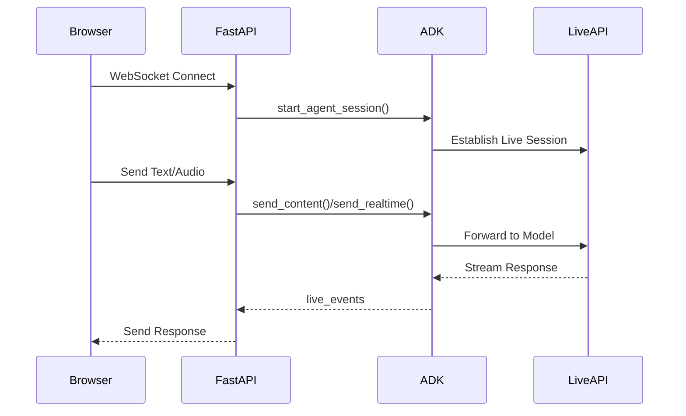

# Documentation Review Report: custom-streaming-ws.md

**Document:** `gcp-blogs/20251028_claude_reviewer_for_adk/article_after_review/custom-streaming-ws.md`  
**Reviewer:** Documentation Quality Review System  
**Review Date:** 2025-10-28  
**Report ID:** docs_review_report_custom-streaming-ws_20251028-162615

---

## Executive Summary

This review analyzes the custom-streaming-ws.md documentation, which covers building a custom asynchronous web application with ADK Streaming and FastAPI for real-time, bidirectional audio and text communication via WebSockets.

**Overall Assessment:** The documentation is well-structured and comprehensive, providing both server-side and client-side implementation details. However, there are several areas requiring improvement for better consistency, clarity, and technical accuracy.

**Statistics:**
- Critical Issues: 5
- Warnings: 12
- Suggestions: 8
- Total Issues: 25

---

## Critical Issues

### C1: Inconsistent Model Name in Code vs Text

- **Category:** Technical Accuracy
- **Location:** Lines 114-115, 122, 181
- **Problem:** The documentation mentions `gemini-2.0-flash-exp` as the primary model but also references `gemini-2.0-flash-live-001`. The explanation at line 122 is confusing.
- **Current State:**
  ```python
  # Line 114
  model="gemini-2.0-flash-exp", # if this model does not work, try below
  #model="gemini-2.0-flash-live-001",
  ```
  
  Line 122: "To enable both text and audio/video input, the model must support the generateContent (for text) and bidiGenerateContent methods. Verify these capabilities by referring to the [List Models Documentation](https://ai.google.dev/api/models#method:-models.list). This quickstart utilizes the gemini-2.0-flash-exp model for demonstration purposes."

- **Expected State:** 
  - Clarify which model is recommended and why
  - Explain the difference between the two models
  - If `gemini-2.0-flash-exp` is preferred, explain when to use the alternative
  - The note about model capabilities should be placed before the code example

- **Recommendation:** 
  1. Add a clear explanation before the code: "This example uses `gemini-2.0-flash-exp` which supports both Live API streaming and regular `generateContent` methods. If this model is unavailable, use `gemini-2.0-flash-live-001`."
  2. Move the model compatibility note (line 122) to appear before the code example
  3. Remove the commented-out line or make it part of a proper troubleshooting section

### C2: Incomplete Import in Session Resumption Section

- **Category:** Code Quality
- **Location:** Lines 294-296
- **Problem:** The session resumption section shows importing `from google.genai import types` but this import is not shown in the main imports section at lines 195-220
- **Current State:**
  ```python
  # Line 294-296
  1. **Import the required types**:
  ```py
  from google.genai import types
  ```
  
  But the main imports section (lines 204-208) shows:
  ```python
  from google.genai.types import (
      Part,
      Content,
      Blob,
  )
  ```

- **Expected State:** 
  - Either add `types` to the main imports: `from google.genai import types`
  - Or update the session resumption section to use the full path: `types.SessionResumptionConfig()`
  - Ensure consistency between all code examples

- **Recommendation:** 
  1. Update the main imports section to include: `from google.genai import types`
  2. Update line 252 in the commented code to use `types.SessionResumptionConfig()`
  3. Ensure all code examples are consistent with imports

### C3: Incorrect Function Reference in Code

- **Category:** Code Quality
- **Location:** Lines 234, 259
- **Problem:** The function uses `InMemoryRunner` which is not imported and doesn't appear to be a valid ADK class
- **Current State:**
  ```python
  # Line 234
  runner = InMemoryRunner(
      app_name=APP_NAME,
      agent=root_agent,
  )
  ```

- **Expected State:** Should use `Runner` class which is imported at line 210
  ```python
  runner = Runner(
      app_name=APP_NAME,
      agent=root_agent,
      session_service=session_service,
  )
  ```

- **Recommendation:** 
  1. Replace `InMemoryRunner` with `Runner`
  2. Add `session_service` parameter to the Runner initialization
  3. Verify this against actual ADK documentation

### C4: Missing Function Definition and Context

- **Category:** Structure
- **Location:** Lines 222-226
- **Problem:** The document jumps directly to describing imports without showing the complete server code structure. There's no context about where `APP_NAME` is defined or how `load_dotenv()` is used.
- **Current State:**
  ```python
  # Lines 222-226 only show bullet points explaining imports but no actual code showing:
  # - load_dotenv() call
  # - APP_NAME definition
  # - session_service initialization
  ```

- **Expected State:** Should show complete initialization code:
  ```python
  # Load environment variables
  load_dotenv()
  
  # Application configuration
  APP_NAME = "adk-streaming-ws"  # or from environment
  
  # Initialize session service
  session_service = InMemorySessionService()
  ```

- **Recommendation:** Add a complete "Initialization" code block before the imports section showing all startup configuration

### C5: Typo in Code Comment

- **Category:** Code Quality
- **Location:** Line 367
- **Problem:** Typo in comment: "parial" should be "partial"
- **Current State:**
  ```python
  # Line 367
  # If it's text and a parial text, send it
  ```

- **Expected State:**
  ```python
  # If it's text and a partial text, send it
  ```

- **Recommendation:** Fix the typo

---

## Warnings

### W1: Inconsistent Heading Level Structure

- **Category:** Structure
- **Location:** Lines 103, 227, 286, 328, 388, 424, 492
- **Problem:** Section headings use inconsistent levels. Some subsections use `###` (agent.py, function descriptions) while major sections use `##`
- **Current State:**
  - Line 103: `### agent.py` (subsection under section 2)
  - Line 227: `### start_agent_session(...)` (function description)
  - Line 424: `### FastAPI Web Application` (should be same level as other subsections)
  
- **Expected State:** 
  - Major sections: `## 1. Setup`, `## 2. Platform Setup`, `## 3. Interact`, `## 4. Server Code`, `## 5. Client Code`
  - Subsections within sections: `### Subsection Title`
  - Code examples/functions: `#### Function Name` or maintain as `###` consistently

- **Recommendation:** 
  1. Use `####` for function/code example titles (start_agent_session, agent_to_client_messaging, etc.)
  2. Use `###` for conceptual subsections (ADK Streaming Setup, WebSocket Handling, Audio Handling)
  3. Ensure consistent hierarchy throughout

### W2: Inconsistent Code Comment Style

- **Category:** Code Quality
- **Location:** Throughout code examples
- **Problem:** Code comments use inconsistent styles - some are descriptive, some are redundant, some are missing
- **Current State:**
  - Line 231: `"""Starts an agent session"""` - Good docstring
  - Line 245: `# Set response modality` - Good explanatory comment
  - Line 233: `# Create a Runner` - Somewhat redundant (obvious from code)
  - Line 403: `# Send a text message` - Redundant comment
  
- **Expected State:** Follow the commenting philosophy from the review checklist:
  - Use comments to explain "why" not "what"
  - Avoid redundant comments for self-documenting code
  - Use detailed comments for teaching examples, minimal for production examples

- **Recommendation:** 
  1. Remove redundant comments like "Create a Runner" where code is self-documenting
  2. Add comments explaining non-obvious logic (e.g., why Base64 encoding is needed)
  3. Add phase labels for multi-step processes in teaching examples

### W3: Missing Cross-References

- **Category:** Style
- **Location:** Lines 14, 126
- **Problem:** References to related content don't follow consistent format
- **Current State:**
  - Line 14: "There is also a [SSE](custom-streaming.md) version of the sample is available." - Awkward wording
  - Line 126: Reference to image uses relative path `../assets/quickstart-streaming-tool.png`
  
- **Expected State:**
  - Use consistent cross-reference format: "> Learn More: [SSE version of this sample](custom-streaming.md)"
  - Verify image paths are correct for the deployment location

- **Recommendation:** 
  1. Rewrite line 14: "> Learn More: An [SSE (Server-Sent Events) version](custom-streaming.md) of this sample is also available."
  2. Verify all image paths work in the final deployment location

### W4: Inconsistent Table Formatting

- **Category:** Structure
- **Location:** Lines 269-272
- **Problem:** Table has inconsistent alignment - text columns should be left-aligned, but markdown doesn't specify alignment
- **Current State:**
  ```markdown
  | Parameter    | Type    | Description                                             |
  |--------------|---------|---------------------------------------------------------|
  | `user_id` | `str`   | Unique client identifier.                       |
  | `is_audio`   | `bool`  | `True` for audio responses, `False` for text (default). |
  ```

- **Expected State:** Add explicit alignment markers:
  ```markdown
  | Parameter | Type | Description |
  |-----------|------|-------------|
  | `user_id` | `str` | Unique client identifier. |
  | `is_audio` | `bool` | `True` for audio responses, `False` for text (default). |
  ```

- **Recommendation:** 
  1. Add explicit left-alignment markers (`|---|`) to table header separator
  2. Make table headers bold: `| **Parameter** | **Type** | **Description** |`
  3. Ensure consistent spacing in table cells

### W5: Unclear Section Purpose

- **Category:** Structure
- **Location:** Lines 286-327 (Session Resumption Configuration)
- **Problem:** This section appears after the main function explanation but is actually an optional enhancement. Its placement disrupts the flow.
- **Current State:** Session resumption section appears between `start_agent_session()` function and `agent_to_client_messaging()` function

- **Expected State:** 
  - Either integrate session resumption directly into the `start_agent_session()` explanation
  - Or move it to a "Advanced Features" section at the end
  - Or clearly mark it as an aside/enhancement

- **Recommendation:** 
  1. Add a note box at the beginning: "Note: Session Resumption (Optional Enhancement)"
  2. Or move this section to after all basic functions are explained
  3. Add a clear transition: "Before continuing with the messaging functions, let's explore an optional feature..."

### W6: Inconsistent Terminology

- **Category:** Style
- **Location:** Throughout document
- **Problem:** Mixing terms like "app" vs "application", "agent" vs "ADK agent", "server" vs "backend"
- **Current State:**
  - Line 3: "web app"
  - Line 186: "server app"
  - Line 494: "JavaScript app.js"
  - Line 185: "ADK agent"
  - Line 187: "the agent"

- **Expected State:** Use consistent terminology:
  - "application" for formal descriptions, "app" for casual
  - "ADK agent" on first mention, "agent" thereafter in same section
  - "server" and "backend" should be used consistently

- **Recommendation:** 
  1. Use "application" in headings and formal descriptions
  2. Use "app" in casual explanations and code
  3. Always use "ADK agent" in technical sections
  4. Use "server" consistently instead of mixing with "backend"

### W7: Missing Error Handling Explanation

- **Category:** Completeness
- **Location:** Lines 392-413 (client_to_agent_messaging function)
- **Problem:** The function raises ValueError but doesn't explain how errors are handled or logged
- **Current State:**
  ```python
  # Line 412
  raise ValueError(f"Mime type not supported: {mime_type}")
  ```
  No explanation of what happens when this error is raised

- **Expected State:** Add explanation:
  - What happens when an error is raised
  - How the error affects the WebSocket connection
  - Whether the error is logged
  - Best practices for error handling in production

- **Recommendation:** Add a note after the code explaining error handling strategy and suggesting production improvements

### W8: Incomplete Example Code

- **Category:** Code Quality
- **Location:** Lines 229-264 (start_agent_session function)
- **Problem:** The function uses variables that aren't defined in the shown code (`APP_NAME`, `session_service`)
- **Current State:** Function references `APP_NAME` and `session_service` without showing where they come from

- **Expected State:** Either:
  - Show the complete context including variable definitions
  - Add comments indicating these are defined elsewhere: `# APP_NAME defined in initialization`
  - Add cross-references: "See Initialization section for APP_NAME definition"

- **Recommendation:** Add comments in the code:
  ```python
  # APP_NAME and session_service are defined during initialization
  runner = Runner(
      app_name=APP_NAME,  # Defined at module level
      agent=root_agent,
  )
  ```

### W9: Inconsistent Code Block Language Tags

- **Category:** Code Quality
- **Location:** Lines 20, 31, 37, 75, 96, 136
- **Problem:** Some code blocks use language tags, some don't, inconsistent capitalization
- **Current State:**
  - Line 20: ` ```bash ` - correct
  - Line 75: ` ```env title=".env" ` - has title attribute
  - Line 136: ` ```console ` - uses "console" instead of "bash"
  - Line 512: ` ```JavaScript ` - capital J (should be lowercase)

- **Expected State:** 
  - Use lowercase language identifiers consistently
  - Use "bash" for shell commands
  - Use "python" or "py" consistently (choose one)
  - Use "javascript" or "js" consistently (choose one)

- **Recommendation:** 
  1. Standardize on lowercase: `javascript`, `python`, `bash`
  2. Use `bash` for all shell examples
  3. Use `console` only for output, not commands

### W10: Missing Prerequisites Section

- **Category:** Completeness
- **Location:** Line 5 (Note about experience)
- **Problem:** Prerequisites are mentioned casually but not comprehensive
- **Current State:**
  ```markdown
  **Note:** This guide assumes you have experience of JavaScript and Python `asyncio` programming.
  ```

- **Expected State:** A proper Prerequisites section listing:
  - JavaScript and Python asyncio experience
  - Understanding of WebSockets
  - Familiarity with FastAPI (or async web frameworks)
  - Basic understanding of Web Audio API
  - Node.js/npm if required for any client tools

- **Recommendation:** Add a proper "Prerequisites" section before "Supported models" with all requirements listed

### W11: Ambiguous Numbering in Headings

- **Category:** Structure
- **Location:** Lines 16, 67
- **Problem:** Section numbering uses escaped periods (2\.) which may render incorrectly
- **Current State:**
  ```markdown
  ## 2\. Set up the platform {#2.-set-up-the-platform}
  ```

- **Expected State:**
  ```markdown
  ## 2. Set up the platform {#2-set-up-the-platform}
  ```

- **Recommendation:** 
  1. Remove backslash escaping from heading numbers
  2. Update anchor IDs to use hyphens instead of periods
  3. Ensure all cross-references use the updated anchor format

### W12: Inconsistent List Formatting

- **Category:** Style
- **Location:** Lines 187-191, 274-281, 496-502
- **Problem:** Lists use inconsistent styles - some numbered, some bulleted, inconsistent punctuation
- **Current State:**
  - Lines 187-191: Numbered list without periods
  - Lines 274-281: Numbered list with periods and mixed formatting
  - Lines 496-502: Numbered list without periods

- **Expected State:** Follow consistent list formatting:
  - Use numbers for sequential steps
  - Use bullets for non-sequential items
  - End items with periods if they're complete sentences
  - No periods for sentence fragments

- **Recommendation:** Standardize all lists to follow the same formatting rules

---

## Suggestions

### S1: Add Visual Architecture Diagram

- **Category:** Enhancement
- **Location:** After line 191 (before section 4)
- **Problem:** The document lacks an overall architecture diagram showing how components interact
- **Recommendation:** Add a Mermaid diagram showing:
  - Browser (WebSocket client)
  - FastAPI server
  - ADK Runner
  - Live API
  - Data flow arrows
  
Example:


### S2: Add Complete Runnable Example

- **Category:** Enhancement
- **Location:** End of document (before Summary)
- **Problem:** Code snippets are scattered throughout; no single place with complete runnable code
- **Recommendation:** Add a "Complete Code Reference" section with links to:
  - Full server code (main.py)
  - Full client code (app.js)
  - Complete project structure
  - Or link to GitHub repository with complete example

### S3: Improve Troubleshooting Section

- **Category:** Enhancement
- **Location:** Lines 178-181
- **Problem:** Troubleshooting tips are basic and limited
- **Recommendation:** Expand troubleshooting section to include:
  - WebSocket connection issues (CORS, firewall, etc.)
  - Audio permission problems
  - Common ADK errors
  - Debugging techniques (console logs, network inspection)
  - Performance issues (latency, buffering)

### S4: Add Production Deployment Considerations Earlier

- **Category:** Structure
- **Location:** Lines 746-756 (currently only in Summary)
- **Problem:** Production considerations are only mentioned at the very end
- **Recommendation:** 
  1. Add a brief note in Section 2 (Platform Setup) about production vs development
  2. Create a dedicated section "Production Considerations" before Summary
  3. Include topics like:
     - Security (authentication, authorization)
     - Session management at scale
     - Monitoring and logging
     - Rate limiting
     - Error recovery strategies

### S5: Enhance Code Comments with Teaching Context

- **Category:** Code Quality
- **Location:** Throughout code examples
- **Problem:** Some complex async patterns lack explanatory comments
- **Recommendation:** Add teaching comments to complex sections:
  - Line 462: Explain why `asyncio.FIRST_EXCEPTION` is used
  - Line 465: Explain why LiveRequestQueue must be closed
  - Line 452-458: Add phase labels for the concurrent tasks setup
  
Example:
```python
# Phase 1: Create concurrent messaging tasks
agent_to_client_task = asyncio.create_task(
    agent_to_client_messaging(websocket, live_events)
)
client_to_agent_task = asyncio.create_task(
    client_to_agent_messaging(websocket, live_request_queue)
)

# Phase 2: Wait for connection close or error
# Using FIRST_EXCEPTION ensures we catch and handle errors immediately
tasks = [agent_to_client_task, client_to_agent_task]
await asyncio.wait(tasks, return_when=asyncio.FIRST_EXCEPTION)

# Phase 3: Cleanup
# Close the queue to ensure graceful termination
live_request_queue.close()
```

### S6: Add Audio Format Specifications

- **Category:** Completeness
- **Location:** Section 5 (Client Code), Audio Handling
- **Problem:** Document doesn't specify audio format details (sample rate, bit depth, channels)
- **Recommendation:** Add a subsection explaining:
  - PCM format specifications (16-bit, 16kHz, mono)
  - Why this format is used
  - Browser compatibility notes
  - Link to AudioWorklet documentation

### S7: Improve Introduction

- **Category:** Style
- **Location:** Lines 1-5
- **Problem:** Introduction is brief and doesn't set expectations
- **Recommendation:** Expand introduction to include:
  - What readers will learn
  - What they'll build by the end
  - Estimated time to complete
  - Link to the complete demo or video walkthrough

### S8: Add Best Practices Section

- **Category:** Enhancement
- **Location:** Before Summary
- **Problem:** Document shows how to build the app but lacks guidance on best practices
- **Recommendation:** Add a "Best Practices" section covering:
  - When to use WebSocket vs SSE
  - Audio quality optimization
  - Latency reduction techniques
  - Resource cleanup patterns
  - Testing strategies for streaming apps

---

## Positive Highlights

The documentation demonstrates several strengths:

1. **Comprehensive Coverage:** Both server and client code are thoroughly explained
2. **Progressive Disclosure:** Moves from setup to implementation to interaction logically
3. **Multi-Platform Support:** Covers both Google AI Studio and Vertex AI configurations
4. **Interactive Elements:** Includes clear instructions for testing the application
5. **Code-First Approach:** Shows actual implementation rather than just concepts
6. **Real-World Context:** Addresses audio mode switching and bidirectional communication
7. **Visual Aids:** Includes screenshots showing the UI at different stages

---

## Recommendations Summary

### High Priority (Do Immediately)

1. Fix C1: Clarify model selection and compatibility
2. Fix C2: Resolve import inconsistencies for session resumption
3. Fix C3: Correct `InMemoryRunner` to `Runner`
4. Fix C4: Add complete initialization code
5. Fix W1: Standardize heading hierarchy
6. Fix W11: Remove escaped periods in headings

### Medium Priority (Do Soon)

7. Fix W2: Improve code comment quality (remove redundant, add explanatory)
8. Fix W3: Improve cross-references and verify image paths
9. Fix W7: Add error handling explanations
10. Fix W8: Add context comments for undefined variables
11. Fix W10: Create proper Prerequisites section
12. Fix W12: Standardize list formatting

### Low Priority (Nice to Have)

13. Implement S1: Add architecture diagram
14. Implement S2: Provide complete runnable example
15. Implement S3: Expand troubleshooting section
16. Implement S4: Add production considerations earlier
17. Implement S5: Enhance teaching comments
18. Implement S6: Document audio format specifications
19. Implement S7: Improve introduction
20. Implement S8: Add best practices section

---

## Conclusion

The custom-streaming-ws.md documentation provides solid technical content with comprehensive coverage of both server and client implementation. The main areas for improvement are:

1. **Technical Accuracy:** Fix code inconsistencies and incorrect references
2. **Structural Consistency:** Standardize heading levels and formatting
3. **Code Quality:** Improve comments and ensure all examples are runnable
4. **Completeness:** Add missing context, prerequisites, and production guidance

Once the critical and warning-level issues are addressed, this will be an excellent tutorial for building real-time streaming applications with ADK. The document successfully balances detail with readability and provides practical, actionable guidance.

**Estimated Effort to Address Issues:**
- Critical Issues: 2-3 hours
- Warnings: 3-4 hours  
- Suggestions: 4-6 hours
- **Total:** 9-13 hours for complete revision

