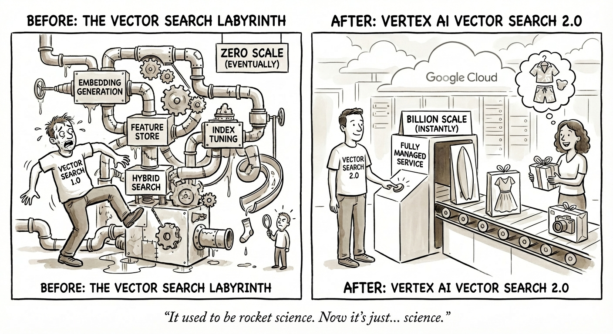
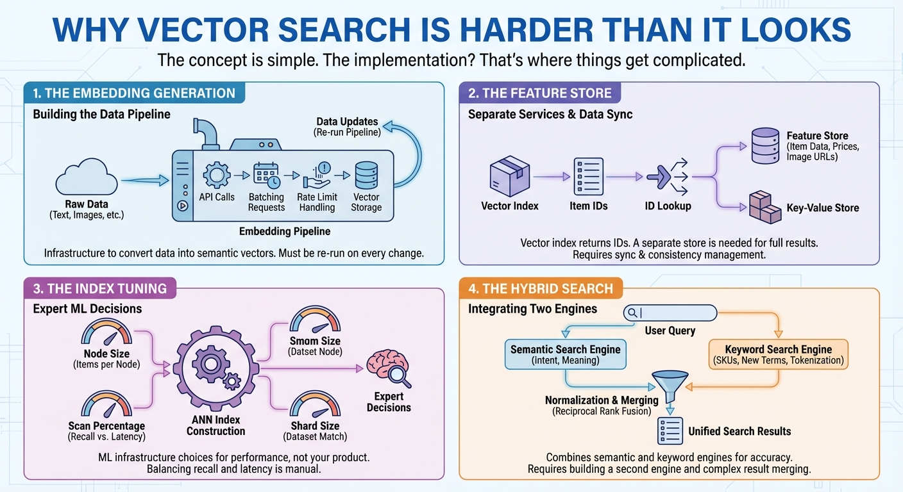
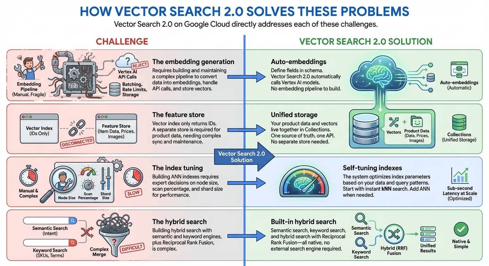
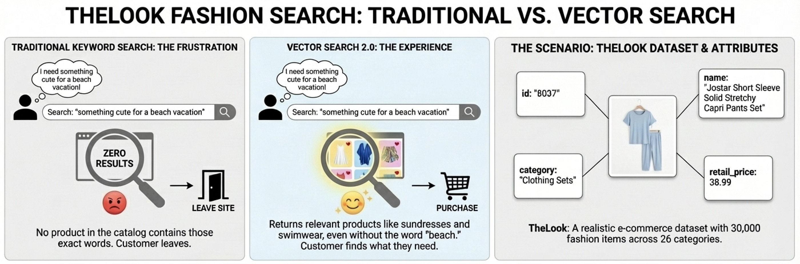
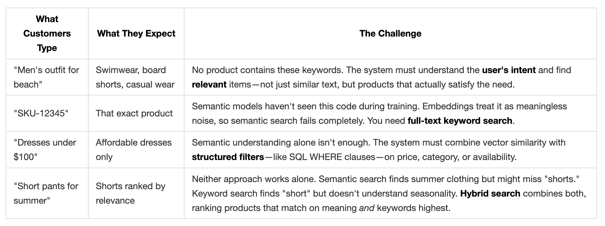
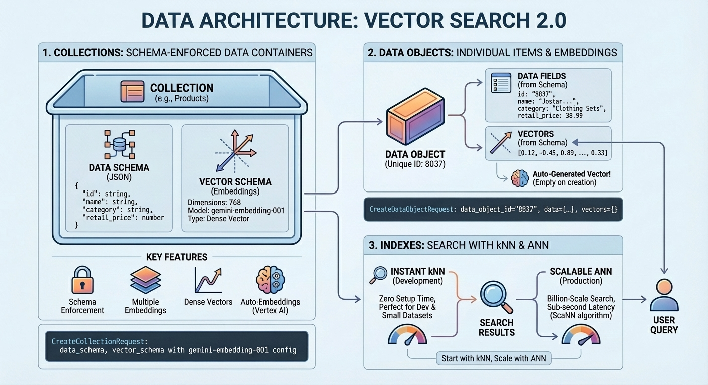
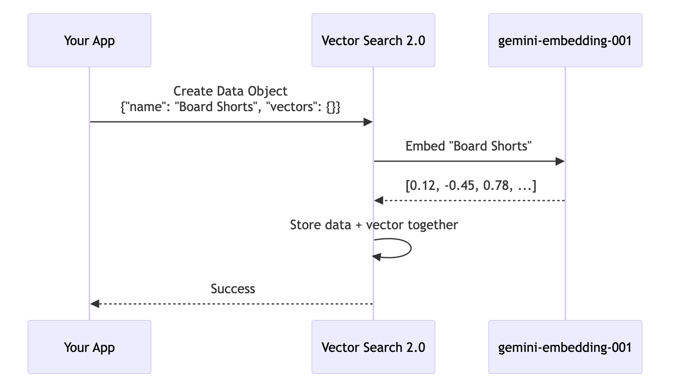
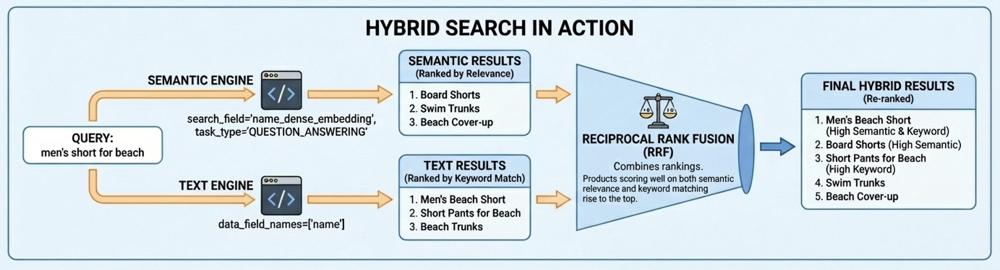
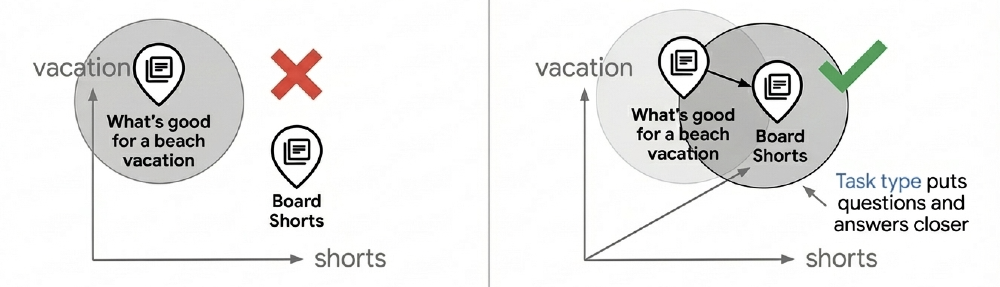
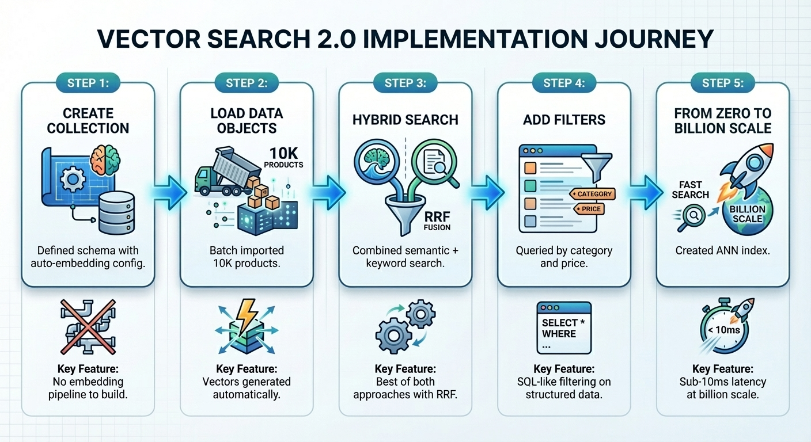

# Introducing Vertex AI Vector Search 2.0: From Zero to Billion Scale

[Vector search](https://en.wikipedia.org/wiki/Vector_database), or Vector database, has become a foundational technology for modern AI systems. By representing data as high-dimensional embeddings that capture semantic meaning, it powers everything from **semantic search** that understands user intent, to **recommendation engines** that surface relevant content, to **Retrieval-Augmented Generation (RAG)** and **AI Agents** that ground LLM responses in real, up-to-date information. Major tech companies including Google rely on this technology at massive scale to process billions of searches, recommendations and groundings daily.

Yet building production-ready vector search remains challenging. Google recently released [Vertex AI Vector Search 2.0](https://cloud.google.com/vertex-ai/docs/vector-search-2/overview) to change that—a fully managed service designed to eliminate the operational complexity that slows teams down.



## Why Vector Search Is Harder Than It Looks

The concept is simple. The implementation? That's where things get complicated.



**The embedding generation.** Vector search requires converting your data into numerical representations (embeddings) that capture semantic meaning. This means you need to call an [embedding API](https://cloud.google.com/vertex-ai/generative-ai/docs/embeddings), batch your requests, handle rate limits, and store the vectors. Every time your data changes, you re-run the pipeline. It's infrastructure you have to build before you can even start searching.

**The feature store.** Many vector search products provide only a vector index that returns a list of item IDs for each search. To serve full search results to users, you need a separate [feature store](https://cloud.google.com/vertex-ai/docs/featurestore/latest/overview) or [key-value store](https://cloud.google.com/bigtable/docs/overview) to retrieve the actual item data—names, prices, categories, image URLs in millisecs—by passing those IDs. In many cases, you also need to implement complex filtering on item features such as price, category, or availability. This means building and maintaining two different services: one for vector search, one for data retrieval and filtering. Every update and query requires accessing and syncing both systems.

**The index tuning.** To build [approximate nearest neighbor (ANN)](https://en.wikipedia.org/wiki/Nearest_neighbor_search) indexes with millions of items, you need to make [expert decisions](https://cloud.google.com/vertex-ai/docs/vector-search/configuring-indexes) to get the best performance: How many items should each index node hold? What percentage of the index should be scanned per query to balance recall against latency? What shard size matches your dataset? These are ML infrastructure decisions that have nothing to do with your actual product.

**The hybrid search.** Semantic search excels at understanding intent—finding "Board Shorts" when users search "men's outfit for beach." But it fails on product codes like "SKU-12345" that have no semantic meaning, and struggles with newly coined terms or brand names the embedding model has never seen. Keyword search handles these cases but misses semantic context. Users need both, which is why [hybrid search](https://github.com/GoogleCloudPlatform/generative-ai/blob/main/embeddings/hybrid-search.ipynb) has become essential. Building it, however, is far from trivial. You need a full-text search engine with tokenization, inverted indexes, or sparse embeddings—in addition to your vector search engine. Then you must run parallel queries on both engines, normalize their different scoring systems, and merge results with techniques like Reciprocal Rank Fusion.

## How Vector Search 2.0 Solves These Problems

Vector Search 2.0 on Google Cloud directly addresses each of these challenges:



| Challenge | Vector Search 2.0 Solution |
|-----------|---------------------------|
| **The embedding generation** | **Auto-embeddings**: Define which fields to embed in your schema. Vector Search 2.0 calls Vertex AI embedding models automatically—no embedding pipeline to build or maintain. |
| **The feature store** | **Unified storage**: Your product data and vectors live together in Collections with an SQL-like filtering capability. One source of truth, one API. No separate feature store needed. |
| **The index tuning** | **Self-tuning indexes**: The system optimizes index parameters based on your data and query patterns. Start with instant kNN search (no index needed), add self-tuning ANN indexes when you need millisec latency at massive scale. |
| **The hybrid search** | **Built-in hybrid search**: Provides built-in full-text search without needing to generate sparse embeddings or inverted index yourself. Semantic search, keyword search, and hybrid search with Reciprocal Rank Fusion—all native, no external search engine required. |

In this post, I'll walk through the [official tutorial notebook](https://github.com/GoogleCloudPlatform/generative-ai/blob/main/embeddings/vector-search-2-intro.ipynb), which builds a fully-managed hybrid search using 10,000 fashion products from the [TheLook e-commerce dataset](https://console.cloud.google.com/marketplace/product/bigquery-public-data/thelook-ecommerce).

## The Scenario: TheLook Fashion Search

Imagine a customer lands on your e-commerce site and types "something cute for a beach vacation." With traditional keyword search, they get zero results—no product in your catalog contains those exact words. Frustrated, they leave.

Now imagine a different experience. The same query returns sundresses, swimwear cover-ups, and flowy shorts—products that perfectly match what the customer had in mind, even though none contain the word "beach" in their titles. That's the experience vector search enables.

To demonstrate how Vector Search 2.0 makes this possible, we'll build a product search system using [TheLook](https://console.cloud.google.com/marketplace/product/bigquery-public-data/thelook-ecommerce), a realistic e-commerce dataset with 30,000 fashion items across 26 categories. Each product has attributes you'd find in any real catalog:



### The Search Challenges We'll Solve

Real customers don't search the way databases expect. They search the way they think:



Vector Search 2.0 solves all four challenges with a unified architecture. The rest of this post walks through the [official tutorial notebook](https://github.com/GoogleCloudPlatform/generative-ai/blob/main/embeddings/vector-search-2-intro.ipynb), showing how each piece fits together.

## Vector Search 2.0 Data Architecture

Before diving into code, let's understand how Vector Search 2.0 organizes your data. The architecture centers on three key concepts: Collections, Data Objects, and Indexes.



A **Collection** defines your data structure—the fields you want to store and which ones should be embedded. **Data Objects** are the actual items (products, documents, images) stored in a Collection, each with its data and auto-generated vectors or your own vectors. An **Index** optimizes queries at scale, enabling millisec latency across billions of items. You can start without an index for development with zero setup time, then add one when you need production performance.

## Building TheLook Search: Step by Step

Now let's build a working product search system. We'll load 10,000 fashion items from TheLook, enable auto-embeddings, and run semantic, keyword, and hybrid searches—all in about 50 lines of code.

### Step 1: Create a Collection with Auto-Embeddings

A Collection is like a database table with superpowers. You define your data schema and tell Vector Search 2.0 which fields should be embedded:

```python
from google.cloud import vectorsearch_v1beta

client = vectorsearch_v1beta.VectorSearchServiceClient()

request = vectorsearch_v1beta.CreateCollectionRequest(
    parent=f"projects/{PROJECT_ID}/locations/{LOCATION}",
    collection_id="thelook_products",
    collection={
        "data_schema": {
            "type": "object",
            "properties": {
                "id": {"type": "string"},
                "name": {"type": "string"},
                "category": {"type": "string"},
                "retail_price": {"type": "number"},
            },
        },
        "vector_schema": {
            "name_dense_embedding": {
                "dense_vector": {
                    "dimensions": 768,
                    "vertex_embedding_config": {
                        "model_id": "gemini-embedding-001",
                        "text_template": "{name}",
                        "task_type": "RETRIEVAL_DOCUMENT",
                    },
                },
            },
        },
    },
)

collection = client.create_collection(request=request)
```

This code defines a Collection with two schemas: `data_schema` specifies the product fields (id, name, category, price), and `vector_schema` defines how embeddings are generated. The `vertex_embedding_config` is the key. It tells the system: "Take the product `name`, send it to [gemini-embedding-001](https://docs.cloud.google.com/vertex-ai/generative-ai/docs/embeddings/get-text-embeddings#supported-models), and store the resulting 768-dimensional vector." You never call an embedding API yourself.

### Step 2: Load Products as Data Objects

With the Collection ready, load your product catalog using batch operations. Each product becomes a Data Object with its data fields populated and the `vectors` field left empty—Vector Search 2.0 automatically generates the embeddings:

```python
data_client = vectorsearch_v1beta.DataObjectServiceClient()

# Load products in batches
for batch in product_batches:
    batch_request = [
        {
            "data_object_id": product["id"],
            "data_object": {
                "data": {
                    "id": product["id"],
                    "name": product["name"],
                    "category": product["category"],
                    "retail_price": product["retail_price"],
                },
                "vectors": {},  # Auto-generated from name field
            },
        }
        for product in batch
    ]

    request = vectorsearch_v1beta.BatchCreateDataObjectsRequest(
        parent=collection.name,
        requests=batch_request,
    )
    data_client.batch_create_data_objects(request=request)
```

Notice that `vectors` is an empty object. This is where auto-embeddings work their magic. Here's what happens behind the scenes when you create a Data Object:



You send the product data with empty vectors. Vector Search 2.0 calls the embedding model, gets the vector, and stores everything together. The same auto-embedding process runs whenever you update an existing Data Object, keeping your vectors in sync with your data.

### Step 3: Search with Hybrid Search

Now the payoff. Vector Search 2.0 supports three search modes: **semantic search** (understands intent via embeddings), **text search** (keyword matching), and **hybrid search** (combines both). Hybrid search delivers the best results for most use cases—semantic search finds "Board Shorts" when users search "men's outfit for beach," while text search ensures exact matches like product codes aren't missed.



Here's hybrid search in action for "men's short for beach":

```python
query_text = "men's short for beach"

batch_request = vectorsearch_v1beta.BatchSearchDataObjectsRequest(
    parent=collection.name,
    searches=[
        vectorsearch_v1beta.Search(
            semantic_search=vectorsearch_v1beta.SemanticSearch(
                search_text=query_text,
                search_field="name_dense_embedding",
                task_type="QUESTION_ANSWERING",
                top_k=20,
                output_fields=vectorsearch_v1beta.OutputFields(
                    data_fields=["name", "category", "retail_price"]
                ),
            )
        ),
        vectorsearch_v1beta.Search(
            text_search=vectorsearch_v1beta.TextSearch(
                search_text=query_text,
                data_field_names=["name"],
                top_k=20,
                output_fields=vectorsearch_v1beta.OutputFields(
                    data_fields=["name", "category", "retail_price"]
                ),
            )
        ),
    ],
    combine=vectorsearch_v1beta.BatchSearchDataObjectsRequest.CombineResultsOptions(
        ranker=vectorsearch_v1beta.Ranker(
            rrf=vectorsearch_v1beta.ReciprocalRankFusion(weights=[1.0, 1.0])
        )
    ),
)

results = search_client.batch_search_data_objects(request=batch_request)
```

This code runs two searches in parallel: a `semantic_search` that understands the query's intent through embeddings, and a `text_search` that finds keyword matches in product names. The `combine` parameter with `ReciprocalRankFusion` merges both result sets into a single ranked list.

Reciprocal Rank Fusion (RRF) combines the rankings from both searches. Products that score well on both semantic relevance and keyword matching rise to the top. Here are the actual results from running this query on TheLook:

```
Hybrid search results for 'Men's short for beach' (Semantic + Text with built-in RRF):
================================================================================
 1. Mens Racing Beach Fitted Short Trunk Jammer - $20.97
 2. Beach Depot UPF 50+ Men's Short Sleeve Rash Guard Shirt - $29.95
 3. Relaxed Boardshort Short - $51.75
 4. Original Penguin Men's Fashion Short - $79.00
 5. Bottoms Out Men's Ocean Print Swim Short - $25.00
 6. GOTS Certified 100% Organic Cotton Shorts for Men - $22.00
 7. Men's Jersey Short - $8.49
 8. Hurley Men's 4D Boardshort - $149.50
 9. Mens Hawaiian Board Shorts Island Khaki - $24.99
10. Micros Men's Way Short - $40.88
```


#### Why Task Type Embeddings Matter

Notice the `task_type` parameters in the code above: `RETRIEVAL_DOCUMENT` when indexing products, and `QUESTION_ANSWERING` when searching. This isn't arbitrary—it's a key technique for improving search quality by letting the embedding model work **like a recommendation model**.

Most vector search use cases rely on simple similarity matching, but this often fails to provide production-level search quality because questions and answers aren't inherently similar in embedding space. "What's good for a beach vacation?" and "Board Shorts" have different semantics, yet they should match. Task type embeddings solve this by optimizing the embedding model for asymmetric relationships: documents are embedded differently than queries, creating an embedding space where relevant matches cluster together—adding the capability of recommendation, finding relevant items based on user intent.



Using task-specific embeddings can improve search quality by 30-40% compared to generic embeddings. For a deep dive into how this works, see the [Task Type Embedding notebook](https://github.com/GoogleCloudPlatform/generative-ai/blob/main/embeddings/task-type-embedding.ipynb).

### Step 4: Add Filters for Business Logic

Beyond vector search, you can query your data using SQL-like filters—useful for browsing by category, filtering by price range, or any business logic that doesn't require semantic understanding. Here's how to find affordable jeans under $75:

```python
request = vectorsearch_v1beta.QueryDataObjectsRequest(
    parent=collection.name,
    filter={
        "$and": [
            {"category": {"$eq": "Jeans"}},
            {"retail_price": {"$lt": 75}},
        ]
    },
    output_fields=vectorsearch_v1beta.OutputFields(data_fields=["*"]),
)

results = search_client.query_data_objects(request=request)
```

The [filter expression language](https://docs.cloud.google.com/vertex-ai/docs/vector-search-2/query-search/query#filter_expression_language) supports comparison operators (`$eq`, `$ne`, `$gt`, `$gte`, `$lt`, `$lte`), logical operators (`$and`, `$or`), and array operators (`$in`, `$nin`, `$all`). Here's what the query returns:

```
Jeans under $75:
"Levi's 512 Misses Perfectly Slimming Boo... ($54.00)", 
'YMI Juniors Fleur De Lis Capri Jean... ($25.00)', 
"Lucky Brand Jeans Men's Style: Slim Boot... ($73.96)", 
"Hurley Men's 84 Slim Denim Pant... ($69.45)", 
"KR3W Klassic Jeans - Dark Blue... ($64.00)"
```

You can also combine filters with semantic or hybrid search—for example, finding "casual summer wear" but only in the Shorts category under $50.

### Step 5: From Zero to Billion Scale

Everything we've done so far uses **kNN (k-Nearest Neighbors)**—a brute-force algorithm that compares your query against every vector in the Collection. kNN is perfect for development: zero setup time, instant searches, and 100% accuracy. But as your dataset grows, latency increases linearly.

For production at scale, Vector Search 2.0 offers **ANN (Approximate Nearest Neighbor)** indexes powered by Google's [ScaNN (Scalable Nearest Neighbors)](https://github.com/google-research/google-research/tree/master/scann) algorithm—the same technology behind Google Search, YouTube, and Google Play. ANN trades a tiny amount of accuracy (~99%) for massive speed gains: sub-10ms latency even with billions of vectors.


Creating an ANN index is straightforward:

```python
request = vectorsearch_v1beta.CreateIndexRequest(
    parent=collection.name,
    index_id="product-search-index",
    index={
        "index_field": "name_dense_embedding",
        "filter_fields": ["category", "retail_price"],
        "store_fields": ["name"],
    },
)

operation = client.create_index(request=request)
index = operation.result()
```

The `index_field` specifies which vector field to index, `filter_fields` enables filtering during search, and `store_fields` caches frequently accessed data in the index for faster retrieval. Once created, the index accelerates searches automatically—no code changes required.

## The Complete Picture

In just five steps—with steps 1 through 4 taking only about **5 minutes**—we built a production-ready product search system:



Vector Search 2.0 eliminates the infrastructure complexity that typically slows down vector search adoption. You focus on your product; the platform handles embeddings, indexing, and scaling.

### Try It Yourself

Ready to build your own vector search? Start here:

**Quick start:** [Vector Search 2.0 Introduction Notebook](https://github.com/GoogleCloudPlatform/generative-ai/blob/main/embeddings/vector-search-2-intro.ipynb) — Run in Colab with one click. Load TheLook, run every search type, and see results in minutes.

**Learn more:**
- [Vector Search 2.0 Documentation](https://cloud.google.com/vertex-ai/docs/vector-search-2/overview)
- [Python SDK Reference](https://cloud.google.com/python/docs/reference/vectorsearch/latest)

---

Vector search used to require stitching together embedding pipelines, feature stores, ANN indexes, and full-text search engines. Vector Search 2.0 replaces that complexity with a single, fully managed service—so you can go from zero to billion-scale semantic search without becoming an infrastructure expert.

The gap between "I've heard of vector search" and "I'm running it in production" just got a lot smaller.
