# Introducing Vertex AI Vector Search 2.0: From Zero to Billion Scale

[Vector search](https://en.wikipedia.org/wiki/Vector_database), or Vector database, has become a foundational technology for modern AI systems. By representing data as high-dimensional embeddings that capture semantic meaning, it powers everything from semantic search that understands user intent, to recommendation engines that surface relevant content, to Retrieval-Augmented Generation (RAG) pipelines that ground LLM responses in real, up-to-date information. Major tech companies including Google rely on this technology at massive scale to process billions of searches and recommendations daily.

## Why Vector Search Is Harder Than It Looks

The concept is simple. The implementation? That's where things get complicated.

**The embedding generation.** Vector search requires converting your data into numerical representations (embeddings) that capture semantic meaning. This means you need to call an [embedding API](https://cloud.google.com/vertex-ai/generative-ai/docs/embeddings), batch your requests, handle rate limits, and store the vectors. Every time your data changes, you re-run the pipeline. It's infrastructure you have to build before you can even start searching.

**The feature store.** Many vector search products provide only a vector index that returns a list of item IDs for each search. To serve full search results to users, you need a separate [feature store](https://cloud.google.com/vertex-ai/docs/featurestore/latest/overview) or [key-value store](https://cloud.google.com/bigtable/docs/overview) to retrieve the actual item data—names, prices, categories, image URLs in millisecs—by passing those IDs. This means building and maintaining two different services: one for vector search, one for data retrieval. Every update requires syncing both systems. Data consistency becomes your responsibility.

**The index tuning.** To build [approximate nearest neighbor (ANN)](https://en.wikipedia.org/wiki/Nearest_neighbor_search) indexes with millions of items, you need to make [expert decisions](https://cloud.google.com/vertex-ai/docs/vector-search/configuring-indexes) to get the best performance: How many items should each index node hold? What percentage of the index should be scanned per query to balance recall against latency? What shard size matches your dataset? These are ML infrastructure decisions that have nothing to do with your actual product.

**The hybrid search.** Semantic search can find "Board Shorts" when users search "men's outfit for beach"—but fails when they search "SKU-12345" because product codes have no semantic meaning that embeddings can capture. It also struggles with newly coined terms or brand names that didn't exist when the embedding model was trained. Keyword search can overcome these challenges, but misses semantic intent. Users need both. But building a keyword search engine is its own challenge—you need to tokenize documents, build and maintain an inverted index or sparse embedding index. Then combining semantic and keyword results means running parallel searches on both engines, normalizing scores, and merging results yourself with techniques like Reciprocal Rank Fusion.

Vector Search 2.0 on Google Cloud eliminates these friction points:


- **Auto-embeddings**: Define which fields to embed in your schema. Vector Search 2.0 calls Vertex AI models automatically—no embedding pipeline to build or maintain.
- **Unified storage**: Your product data and vectors live together in Collections. One source of truth, one API.
- **Self-tuning**: The system optimizes index parameters based on your data and query patterns.
- **Built-in hybrid search**: Semantic, keyword, and hybrid search with Reciprocal Rank Fusion—all native.
- **Zero to billion scale**: Start with instant kNN search (no index needed), add ANN indexes when you need sub-second latency at massive scale.

In this post, I'll walk through the [official tutorial notebook](https://github.com/GoogleCloudPlatform/generative-ai/blob/main/embeddings/vector-search-2-intro.ipynb), which builds a semantic product search using 10,000 fashion products from the TheLook e-commerce dataset.

## The Scenario: TheLook Fashion Search

TheLook is a fictional e-commerce clothing company. The dataset includes products like:

- "Jostar Short Sleeve Solid Stretchy Capri Pants Set"
- "Womens Top Stitch Jacket and Pant Set by City Lights"
- "Ulla Popken Plus Size 3-Piece Duster and Pants Set"

The goal: let customers search with natural language—"men's outfit for beach"—and find relevant products even when no keywords match.

## Architecture Overview


**Collections** hold your **Data Objects** (product data + vectors), and optional **Indexes** accelerate searches at scale. Vector Search 2.0 handles embedding generation through Vertex AI automatically.

## Building TheLook Search: Step by Step

### Step 1: Create a Collection with Auto-Embeddings

A Collection is like a database table with superpowers. You define your data schema and tell Vector Search 2.0 which fields should be embedded:

```python
from google.cloud import vectorsearch_v1beta

client = vectorsearch_v1beta.VectorSearchServiceClient()

request = vectorsearch_v1beta.CreateCollectionRequest(
    parent=f"projects/{PROJECT_ID}/locations/{LOCATION}",
    collection_id="thelook_products",
    collection={
        "data_schema": {
            "type": "object",
            "properties": {
                "name": {"type": "string"},
                "category": {"type": "string"},
                "brand": {"type": "string"},
                "retail_price": {"type": "number"},
            },
        },
        "vector_schema": {
            "name_dense_embedding": {
                "dense_vector": {
                    "dimensions": 768,
                    "vertex_embedding_config": {
                        "model_id": "gemini-embedding-001",
                        "text_template": "{name}",
                        "task_type": "RETRIEVAL_DOCUMENT",
                    },
                },
            },
        },
    },
)

collection = client.create_collection(request=request)
```

The `vertex_embedding_config` is the key. It tells the system: "Take the product `name`, send it to `gemini-embedding-001`, and store the resulting 768-dimensional vector." You never call an embedding API yourself.

### Step 2: Load the Product Catalog

Add your 10,000 products. The `vectors` field stays empty—Vector Search 2.0 fills it automatically:

```python
data_client = vectorsearch_v1beta.DataObjectServiceClient()

# Load products in batches
for batch in product_batches:
    requests = [
        {
            "data_object_id": product["id"],
            "data_object": {
                "data": {
                    "name": product["name"],
                    "category": product["category"],
                    "brand": product["brand"],
                    "retail_price": product["retail_price"],
                },
                "vectors": {},  # Auto-generated from name field
            },
        }
        for product in batch
    ]

    data_client.batch_create_data_objects(
        parent=collection.name,
        requests=requests,
    )
```

Here's what happens behind the scenes:


You send the product data with empty vectors. Vector Search 2.0 calls the embedding model, gets the vector, and stores everything together.

### Step 3: Semantic Search in Action

Now the payoff. Search for "men's outfit for beach":

```python
search_client = vectorsearch_v1beta.DataObjectSearchServiceClient()

request = vectorsearch_v1beta.SearchDataObjectsRequest(
    parent=collection.name,
    semantic_search=vectorsearch_v1beta.SemanticSearch(
        search_text="men's outfit for beach",
        search_field="name_dense_embedding",
        task_type="QUESTION_ANSWERING",
        top_k=10,
    ),
    return_fields=["name", "category", "retail_price"],
)

results = search_client.search_data_objects(request=request)
```

The results include swimwear, casual shorts, and beach-appropriate clothing—products that match the intent, not the keywords.

### Step 4: Compare with Keyword Search

For comparison, here's traditional text search for "short":

```python
request = vectorsearch_v1beta.SearchDataObjectsRequest(
    parent=collection.name,
    text_search=vectorsearch_v1beta.TextSearch(
        search_text="short",
        search_field="name",
    ),
    return_fields=["name", "category", "retail_price"],
)
```

This finds products with "short" in the name—useful, but limited to exact matches.

### Step 5: Hybrid Search—Best of Both Worlds

What about "men's short for beach"? The customer wants beach shorts specifically. Hybrid search combines semantic understanding with keyword matching:

```python
semantic_request = vectorsearch_v1beta.SearchDataObjectsRequest(
    semantic_search=vectorsearch_v1beta.SemanticSearch(
        search_text="men's short for beach",
        search_field="name_dense_embedding",
        top_k=20,
    ),
)

text_request = vectorsearch_v1beta.SearchDataObjectsRequest(
    text_search=vectorsearch_v1beta.TextSearch(
        search_text="short",
        search_field="name",
    ),
)

batch_request = vectorsearch_v1beta.BatchSearchDataObjectsRequest(
    parent=collection.name,
    requests=[semantic_request, text_request],
    ranking_config=vectorsearch_v1beta.RankingConfig(
        reciprocal_rank_fusion={}
    ),
    return_fields=["name", "category", "retail_price"],
)

results = search_client.batch_search_data_objects(request=batch_request)
```

Reciprocal Rank Fusion (RRF) combines the rankings from both searches. Products that score well on both semantic relevance and keyword matching rise to the top.

```mermaid
flowchart LR
    Query["🔍 men's short for beach"]

    subgraph Searches["Parallel Searches"]
        direction TB
        Semantic["Semantic Search"]
        Text["Text Search: 'short'"]
    end

    subgraph Results["Individual Results"]
        direction TB
        SR["1. Swim Trunks<br/>2. Beach Towel<br/>3. Board Shorts"]
        TR["1. Short Sleeve Shirt<br/>2. Board Shorts<br/>3. Running Shorts"]
    end

    RRF["Reciprocal Rank Fusion"]
    Final["Final Results:<br/>1. Board Shorts ⭐<br/>2. Swim Trunks<br/>3. Running Shorts"]

    Query --> Searches
    Semantic --> SR
    Text --> TR
    SR --> RRF
    TR --> RRF
    RRF --> Final
```



"Board Shorts" ranks highly in both results, so RRF promotes it to the top—exactly what the customer wanted.

### Step 6: Add Filters for Business Logic

Semantic search becomes even more powerful with filters. Find beach-appropriate clothing under $50:

```python
request = vectorsearch_v1beta.SearchDataObjectsRequest(
    parent=collection.name,
    semantic_search=vectorsearch_v1beta.SemanticSearch(
        search_text="casual beach wear",
        search_field="name_dense_embedding",
        top_k=10,
    ),
    filter={
        "$and": [
            {"category": {"$in": ["Shorts", "Swim", "Tops"]}},
            {"retail_price": {"$lte": 50}},
        ]
    },
    return_fields=["name", "category", "retail_price"],
)
```

The filter language supports comparison operators (`$eq`, `$gt`, `$lte`), logical operators (`$and`, `$or`), and array matching (`$in`, `$nin`).

### Step 7: Scale for Production

During development, Vector Search 2.0 uses kNN (exact) search with zero configuration. For production, create an ANN index:


```python
request = vectorsearch_v1beta.CreateIndexRequest(
    parent=collection.name,
    index_id="product-search-index",
    index={
        "index_field": "name_dense_embedding",
        "filter_fields": ["category", "retail_price"],
        "store_fields": ["name"],
    },
)

operation = client.create_index(request=request)
index = operation.result()
```

The index enables:

- Sub-second latency at billion-scale
- ~99% accuracy compared to exact search
- Efficient filtered queries

Your search code doesn't change—the system automatically uses the index.

## The Complete Picture

Here's what we built:

| Search Type | Query | What It Finds |
|------------|-------|---------------|
| Text | "short" | Products with "short" in name |
| Semantic | "men's outfit for beach" | Beach-appropriate clothing by meaning |
| Hybrid | "men's short for beach" | Best of both: beach items that are shorts |
| Filtered | "casual beach wear" under $50 | Semantic match within business constraints |

All of this with a managed service that handles embeddings, storage, and scaling automatically.

## Try It Yourself

The complete notebook walks through this entire scenario:

[Vector Search 2.0 Introduction Notebook](https://github.com/GoogleCloudPlatform/generative-ai/blob/main/embeddings/vector-search-2-intro.ipynb)

You'll load the TheLook dataset, run each search type, and see the results yourself. The notebook also covers cleanup so you're not charged for resources you're not using.

## Getting Started

1. Enable the Vector Search API in your Google Cloud project
2. Install the client: `pip install google-cloud-vectorsearch`
3. Run the notebook in Colab or Vertex AI Workbench
4. Adapt the patterns to your own product catalog

Vector search transforms how customers discover products. Instead of hoping they guess the right keywords, you meet them where they are—with natural language that just works.

The gap between "I've heard of vector search" and "I'm using it in production" just got a lot smaller.
