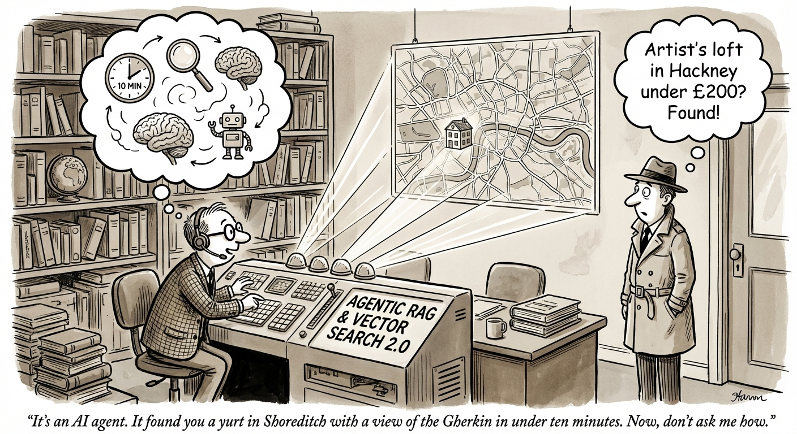
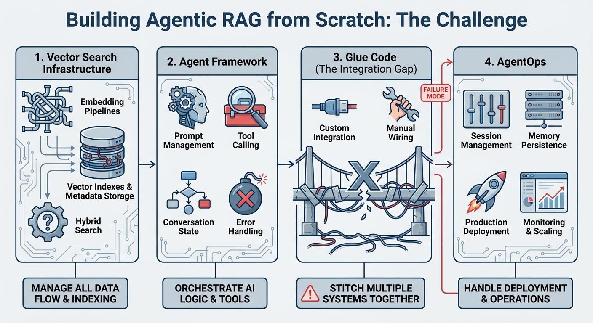
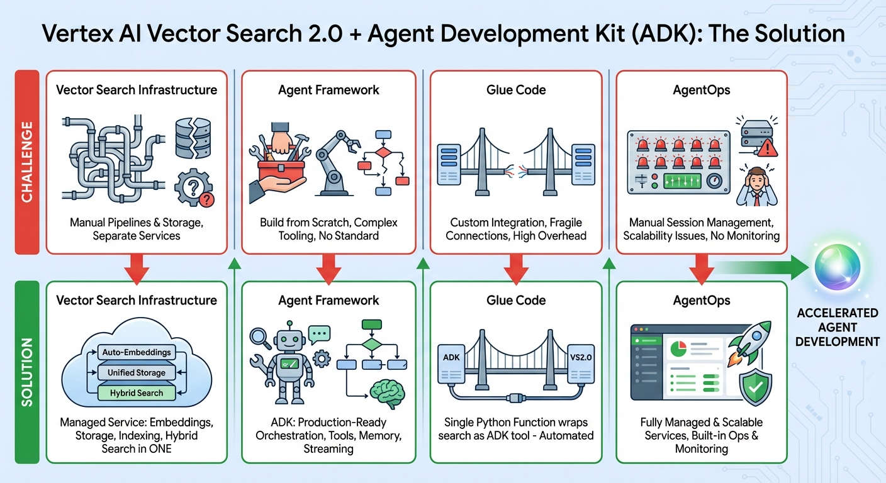

# Agentic RAG Simplified: Fully Managed Retrieval and Reasoning in Under 200 Lines of Code

In my [previous post](../20251203_vs20_intro/article.md), I introduced Vertex AI Vector Search 2.0 and showed how it simplifies building production-ready semantic search. But search is just one piece of the puzzle. The real challenge comes when you want to build **AI agents** that can autonomously retrieve information, reason about it, and take action.

This is where **Agentic RAG** comes in—and where things get complicated.



## The Agentic RAG Challenge

Traditional RAG (Retrieval-Augmented Generation) follows a simple pattern: embed a query, search a vector database, pass results to an LLM, generate a response. It works well for straightforward Q&A but falls short when users need more sophisticated interactions.

Consider a travel agent scenario. A user asks: *"Find me a creative artist workspace in Hackney under £200 that I can book instantly."* This single request requires:

1. **Intent parsing**: Extract "creative artist workspace" as the semantic query
2. **Constraint extraction**: Identify filters (neighborhood=Hackney, price<200, instant_bookable=true)
3. **Tool orchestration**: Call the right search with the right parameters
4. **Result synthesis**: Present findings in a helpful, conversational format

Building this from scratch means stitching together multiple systems:



| Challenge | What You Need to Build |
|-----------|----------------------|
| **Vector search infrastructure** | Embedding pipelines, vector indexes, metadata storage, hybrid search |
| **Agent framework** | Prompt management, tool calling, conversation state, error handling |
| **Glue code** | Custom integration between your agent and your search backend |
| **Scaling concerns** | Session management, memory persistence, production deployment |

Each layer adds complexity. Each integration point is a potential failure mode. And you haven't even started building your actual product yet.

## How Vector Search 2.0 + ADK Solve This

The combination of **Vertex AI Vector Search 2.0** and **Agent Development Kit (ADK)** eliminates this integration overhead. Vector Search 2.0 provides the intelligent retrieval layer; ADK provides the agent orchestration. Together, they let you focus on your use case instead of infrastructure.



| Challenge | Solution |
|-----------|----------|
| **Vector search infrastructure** | Vector Search 2.0 handles embeddings, storage, indexing, and hybrid search in one managed service |
| **Agent framework** | ADK provides production-ready agent orchestration with tools, memory, and streaming |
| **Glue code** | A single Python function wraps your search as an ADK tool—the agent handles the rest |
| **Scaling concerns** | Both services are fully managed with built-in scalability |

In this post, I'll walk through the [Travel Agent notebook](resources/vectorsearch2_travel_agent.ipynb), which demonstrates this architecture by building a vacation rental search agent using real Airbnb data.

## What We're Building

Our travel agent will search 2,000 London Airbnb listings using natural language. Users can ask questions like:

- *"Find me an inspiring workspace in Hackney"*
- *"I want a cozy flat with a garden under £150"*
- *"Show me artist lofts in Shoreditch that I can book instantly"*

The agent will:
1. Parse user intent into semantic queries and metadata filters
2. Execute hybrid search (semantic + keyword) with filtering
3. Present results conversationally

### Architecture Overview

```
┌─────────────────┐     ┌─────────────────┐     ┌─────────────────┐
│                 │     │                 │     │                 │
│   User Query    │────▶│   ADK Agent     │────▶│  Vector Search  │
│                 │     │   (Gemini)      │     │      2.0        │
│                 │     │                 │     │                 │
└─────────────────┘     └────────┬────────┘     └────────┬────────┘
                                 │                       │
                                 │   Tool Call:          │   Hybrid Search:
                                 │   find_rentals()      │   Semantic + Keyword
                                 │                       │   + Filters
                                 ▼                       ▼
                        ┌─────────────────────────────────┐
                        │                                 │
                        │      Conversational Response    │
                        │                                 │
                        └─────────────────────────────────┘
```

## Step 1: Create a Collection with Auto-Embeddings

First, we create a Vector Search 2.0 Collection to store our rental listings. The Collection defines two schemas: a **data schema** for the listing attributes, and a **vector schema** for automatic embedding generation.

```python
from google.cloud import vectorsearch_v1beta

admin_client = vectorsearch_v1beta.VectorSearchServiceClient()

collection_config = {
    # Data schema: defines the structure of your data fields
    "data_schema": {
        "type": "object",
        "properties": {
            "name": {"type": "string"},
            "price": {"type": "number"},
            "neighborhood": {"type": "string"},
            "listing_url": {"type": "string"},
            "instant_bookable": {"type": "string"},
            "description": {"type": "string"},
            "neighborhood_overview": {"type": "string"}
        }
    },

    # Vector schema: configures automatic embedding generation
    "vector_schema": {
        "description_embedding": {
            "dense_vector": {
                "dimensions": 768,
                "vertex_embedding_config": {
                    "model_id": "gemini-embedding-001",
                    # Combine description + neighborhood for richer embeddings
                    "text_template": "Description: {description}. Neighborhood: {neighborhood_overview}.",
                    "task_type": "RETRIEVAL_DOCUMENT"
                }
            }
        }
    }
}

request = vectorsearch_v1beta.CreateCollectionRequest(
    parent=f"projects/{PROJECT_ID}/locations/{LOCATION}",
    collection_id="london-travel-agent-demo",
    collection=collection_config
)

operation = admin_client.create_collection(request=request)
operation.result()
```

The key here is `vertex_embedding_config`. By specifying `model_id` and `text_template`, Vector Search 2.0 automatically generates embeddings using the Gemini embedding model. You never call an embedding API yourself—just add data, and embeddings appear.

The `text_template` combines multiple fields (`{description}` and `{neighborhood_overview}`) into a single string before embedding. This creates richer semantic representations that capture both what the listing offers and where it's located.

## Step 2: Ingest Data with Automatic Embeddings

With the Collection ready, we load 2,000 Airbnb listings. Each listing becomes a Data Object with an empty `vectors` field—Vector Search 2.0 fills it automatically:

```python
data_client = vectorsearch_v1beta.DataObjectServiceClient()

# Prepare batch of Data Objects
batch_request = []
for _, row in df_demo.iterrows():
    batch_request.append({
        "data_object_id": str(row['id']),
        "data_object": {
            "data": {
                "name": row['name'],
                "price": float(row['price']),
                "neighborhood": row['neighbourhood_cleansed'],
                "instant_bookable": row['instant_bookable'],
                "listing_url": row['listing_url'],
                "description": row['description'],
                "neighborhood_overview": row['neighborhood_overview']
            },
            # Empty vectors triggers auto-embedding generation
            "vectors": {}
        }
    })

# Batch upload (max 250 per request for gemini-embedding-001)
request = vectorsearch_v1beta.BatchCreateDataObjectsRequest(
    parent=collection_path,
    requests=batch_request[:100]  # Process in batches
)
data_client.batch_create_data_objects(request)
```

Behind the scenes, Vector Search 2.0:
1. Receives your data with empty vectors
2. Applies the `text_template` to generate embedding input
3. Calls `gemini-embedding-001` with `RETRIEVAL_DOCUMENT` task type
4. Stores the resulting 768-dimensional vector alongside your data

No embedding pipeline to maintain. No vector synchronization to worry about.

## Step 3: Build the Hybrid Search Tool

Now we create the function that our ADK agent will call. This function performs **hybrid search**—combining semantic understanding with keyword matching—and applies metadata filters:

```python
import json
from typing import Dict, List, Any
from google.cloud import vectorsearch_v1beta

def find_rentals(query: str, filter: str = "") -> List[Dict[str, Any]]:
    """
    Search for vacation rentals using Hybrid Search with metadata filtering.

    Args:
        query: Natural language description (e.g., "artist loft with garden")
        filter: JSON string with metadata filters (e.g., '{"price": {"$lt": 200}}')

    Returns:
        List of matching rentals with name, price, neighborhood, and URL
    """
    # Parse filter JSON if provided
    filter_dict = json.loads(filter) if filter.strip() else None

    # Configure Semantic Search
    semantic_search = vectorsearch_v1beta.SemanticSearch(
        search_text=query,
        search_field="description_embedding",
        filter=filter_dict,
        task_type="QUESTION_ANSWERING",  # Pairs with RETRIEVAL_DOCUMENT
        top_k=10,
        output_fields=vectorsearch_v1beta.OutputFields(
            data_fields=["name", "price", "neighborhood", "listing_url"]
        )
    )

    # Configure Text Search (keyword matching)
    text_search = vectorsearch_v1beta.TextSearch(
        search_text=query,
        data_field_names=["name", "description", "neighborhood_overview"],
        top_k=10,
        output_fields=vectorsearch_v1beta.OutputFields(
            data_fields=["name", "price", "neighborhood", "listing_url"]
        )
    )

    # Execute Hybrid Search with RRF ranking
    request = vectorsearch_v1beta.BatchSearchDataObjectsRequest(
        parent=collection_path,
        searches=[
            vectorsearch_v1beta.Search(semantic_search=semantic_search),
            vectorsearch_v1beta.Search(text_search=text_search)
        ],
        combine=vectorsearch_v1beta.BatchSearchDataObjectsRequest.CombineResultsOptions(
            ranker=vectorsearch_v1beta.Ranker(
                rrf=vectorsearch_v1beta.ReciprocalRankFusion(weights=[0.6, 0.4])
            )
        )
    )

    response = search_client.batch_search_data_objects(request=request)

    # Format results
    results = []
    for res in response.results[0].results:
        data = res.data_object.data
        results.append({
            "name": data.get("name"),
            "price": data.get("price"),
            "neighborhood": data.get("neighborhood"),
            "url": data.get("listing_url")
        })

    return results
```

This function leverages three Vector Search 2.0 capabilities:

### Hybrid Search with RRF

The `BatchSearchDataObjectsRequest` runs two searches in parallel:
- **Semantic search** finds listings that match the *meaning* of the query ("creative workspace" → art studios, lofts, inspiring spaces)
- **Text search** finds listings with exact keyword matches (important for specific terms the embedding model might miss)

**Reciprocal Rank Fusion (RRF)** combines both result sets. Listings that rank high in both searches rise to the top. The `weights=[0.6, 0.4]` gives slightly more importance to semantic relevance.

### Task Type Pairing

Notice the `task_type` parameters:
- `RETRIEVAL_DOCUMENT` during indexing (Step 1)
- `QUESTION_ANSWERING` during search (Step 3)

This asymmetric pairing is crucial for search quality. It tells the embedding model that queries and documents have different semantic structures—"What's good for remote work?" should match "Quiet flat with dedicated desk and fast WiFi" even though they share few words.

### Filter Syntax

The function accepts a JSON filter string with MongoDB-style operators:

```json
// Price under £200
{"price": {"$lt": 200.0}}

// Specific neighborhood
{"neighborhood": {"$eq": "Hackney"}}

// Combined constraints
{"$and": [
    {"neighborhood": {"$eq": "Hackney"}},
    {"price": {"$lt": 200}},
    {"instant_bookable": {"$eq": "t"}}
]}
```

Filters apply *before* the vector search, ensuring all results meet the criteria.

## Step 4: Create the ADK Agent

Now we wire everything together with ADK. The agent uses Gemini to understand user requests, construct appropriate filters, and call our `find_rentals` tool:

```python
from google.adk.agents import Agent
from google.adk.runners import InMemoryRunner

AGENT_INSTRUCTION = '''
You are an expert London Travel Agent helping users find vacation rentals.

You have access to a tool called `find_rentals` with two arguments:
1. `query`: A description of the vibe/place (e.g., "artist loft", "garden flat")
2. `filter`: A JSON string to filter results by metadata

### AVAILABLE FILTER FIELDS
- `price` (number): Price per night in GBP
- `neighborhood` (string): London neighborhood (e.g., "Hackney", "Islington")
- `instant_bookable` (string): "t" for instantly bookable, "f" otherwise

### FILTER SYNTAX EXAMPLES
Price under £200:           {"price": {"$lt": 200.0}}
Specific neighborhood:      {"neighborhood": {"$eq": "Hackney"}}
Combined filters:           {"$and": [{"neighborhood": {"$eq": "Hackney"}}, {"price": {"$lt": 200}}]}

### GUIDELINES
- Extract the semantic/vibe part of the request for the `query` parameter
- Extract price, location, and booking constraints for the `filter` parameter
- Always summarize results in a friendly, helpful manner
'''

# Create the Agent
travel_agent = Agent(
    model='gemini-2.5-flash',
    name='travel_agent',
    instruction=AGENT_INSTRUCTION,
    tools=[find_rentals],  # Bind our Vector Search tool
)

# Create the Runner
runner = InMemoryRunner(agent=travel_agent, app_name="travel_agent")
```

The agent's instruction teaches it how to use the filter syntax and decompose user requests. ADK handles the rest: prompt formatting, tool calling, response generation, and conversation state.

## Step 5: Test the Agent

Let's see the agent in action. When a user asks a complex question, the agent:
1. Parses the natural language into query and filters
2. Calls `find_rentals` with the right parameters
3. Presents results conversationally

### Test: Complex Query with Multiple Constraints

```python
await runner.run_debug(
    "Find me a creative artist workspace in Hackney under £200 that I can book instantly."
)
```

**Agent's tool call:**
```
>>> TOOL CALL: find_rentals (Hybrid Search)
    Query: creative artist workspace
    Filter: {"$and": [{"neighborhood": {"$eq": "Hackney"}}, {"price": {"$lt": 200}}, {"instant_bookable": {"$eq": "t"}}]}
    Found: 10 listings
```

**Agent's response:**
```
Great news! I found several creative artist workspaces in Hackney that are
under £200 and available for instant booking:

*   **The Residential Suite Above Gallery** - £131
*   **Characterful Warehouse Apartment in the Heart of Shoreditch** - £198
*   **Shoreditch with Garden!!!** - £122
*   **Shoreditch Loft** - £151

I hope this selection helps you find the perfect creative space!
```

The agent correctly:
- Extracted "creative artist workspace" as the semantic query
- Constructed a compound filter with three constraints
- Summarized results in a helpful format

### Test: Same Intent, Different Phrasing

```python
await runner.run_debug(
    "Find me a place in Hackney under £200 that I can book instantly. I want a creative artist vibe."
)
```

The agent produces nearly identical results despite different phrasing—demonstrating robust intent understanding.

## The Complete Picture

In under 200 lines of code, we built a production-ready travel agent that:

- **Understands natural language** queries with complex constraints
- **Searches semantically** using auto-generated embeddings
- **Matches keywords** for terms the embedding model might miss
- **Filters by metadata** using SQL-like operators
- **Responds conversationally** with helpful summaries


| Component | What It Handles |
|-----------|----------------|
| **Vector Search 2.0** | Data storage, auto-embeddings, hybrid search, filtering |
| **ADK Agent** | Intent parsing, tool orchestration, conversation management |
| **Your code** | A single `find_rentals` function + agent instructions |

## Try It Yourself

Ready to build your own Agentic RAG system?

**Quick start:** [Travel Agent Notebook](resources/vectorsearch2_travel_agent.ipynb) — Run in Colab with one click. Load real Airbnb data, build the agent, and test queries in minutes.

**Learn more:**
- [Vector Search 2.0 Introduction](../20251203_vs20_intro/article.md) — Deep dive into Vector Search 2.0 features
- [Vector Search 2.0 Documentation](https://cloud.google.com/vertex-ai/docs/vector-search-2/overview)
- [ADK Documentation](https://google.github.io/adk-docs/) — Complete guide to building AI agents
- [Python SDK Reference](https://cloud.google.com/python/docs/reference/vectorsearch/latest)

---

Agentic RAG used to require stitching together vector databases, embedding pipelines, agent frameworks, and custom integration code. Vector Search 2.0 and ADK replace that complexity with two managed services that work together seamlessly.

The gap between "I want to build an AI agent" and "I have a working agent" just got a lot smaller.
