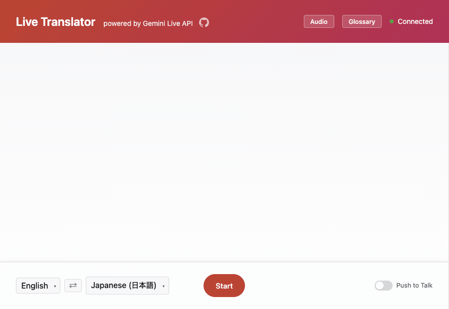

# Building a Real-Time Audio Translator with Gemini Live API

Real-time translation has long been a challenging problem in AI. Traditional approaches required separate speech-to-text, translation, and text-to-speech pipelines, each adding latency and potential errors. With the Gemini Live API, we can now build a seamless, low-latency translation experience that processes audio directly.

In this post, I'll walk through Live Translator—an open-source app that translates speech in real-time across 97 languages. We'll cover how to use it, dive deep into the architecture, and explore the engineering challenges of maintaining continuous sessions.

## What is Live Translator?



**[Try the live demo](https://live-translation-761793285222.us-central1.run.app/)**

Live Translator is a web application that captures your voice, sends it to the Gemini Live API, and plays back the translation in real-time. The experience feels like having a simultaneous interpreter—you speak, and within seconds, you hear the translation.

### Key Features

- **97 supported languages**: From Afrikaans to Zulu, covering major world languages and many regional ones
- **Two input modes**: Always-on continuous translation, or push-to-talk for controlled input
- **Custom glossary**: Pin specific terms to fixed translations—essential for technical terminology, proper nouns, or brand names
- **Live transcription**: See both what was heard and what was translated as text bubbles
- **Browser-based**: No installation required; works on any modern browser with microphone access

### Basic Usage

1. Open the app and select your source and target languages from the bottom bar
2. Click **Start** to begin continuous translation
3. Speak into your microphone—translations appear as text and play as audio

For more control, toggle **Push to Talk** mode. Hold the button (or press spacebar) to transmit, release to stop. This is useful in noisy environments or when you want precise control over what gets translated.

### The Glossary Feature

Technical presentations often include terms that general translation models struggle with. The glossary feature solves this by letting you define exact translations for specific terms.

Upload a CSV file with `source,target,transcription` columns:

```csv
Kubernetes,クバネティス,Kubernetes
Cloud Run,クラウドラン,Cloud Run
Vertex AI,バーテックスエーアイ,Vertex AI
```

The third column is optional—it's a display override. The model pronounces the `target` form (phonetic Japanese), but the on-screen transcript shows the `transcription` form (Latin characters). This is useful when you want phonetically correct audio but readable display text.

## Architecture Deep Dive

The app follows a straightforward architecture with three main components:

```
Browser                          Server (FastAPI)                 Gemini Live API
  |                                  |                                |
  |-- WebSocket /ws/{user}/{sid} --> |                                |
  |   (binary PCM frames)            |-- client.aio.live.connect() -->|
  |                                  |                                |
  |                                  |<-- LiveServerMessage ----------|
  |<-- JSON envelope ---------------- |                                |
  |   (transcription, audio, etc.)   |                                |
```

### The Browser Layer

The frontend captures audio from the microphone using the Web Audio API, resamples it to 16kHz mono PCM (the format Gemini Live API expects), and streams it over a WebSocket connection:

```javascript
async function startAudioRecorderWorklet(audioRecorderHandler, deviceId) {
  const audioContext = new AudioContext({ sampleRate: 16000 });
  await audioContext.audioWorklet.addModule("./pcm-recorder-processor.js");

  const constraints = { audio: { channelCount: 1 } };
  if (deviceId) constraints.audio.deviceId = { exact: deviceId };
  const micStream = await navigator.mediaDevices.getUserMedia(constraints);
  const source = audioContext.createMediaStreamSource(micStream);

  const recorderNode = new AudioWorkletNode(audioContext, "pcm-recorder-processor");
  source.connect(recorderNode);
  
  recorderNode.port.onmessage = (event) => {
    const pcmData = convertFloat32ToPCM(event.data);
    audioRecorderHandler(pcmData);  // Send to WebSocket
  };
}
```

On the receiving end, it plays back 24kHz PCM audio and renders transcription bubbles.

### The FastAPI Server

The server acts as a bridge between the browser WebSocket and the Gemini Live API. This separation is necessary because:

1. **API key protection**: The Gemini API key stays server-side
2. **Session management**: The server handles session lifecycle, including reconnection on expiry
3. **Glossary injection**: The system instruction (including glossary) is built server-side

When a client connects, the server:

1. Accepts the WebSocket connection
2. Waits for a setup message containing the client's glossary
3. Builds a system instruction embedding the language pair and glossary
4. Opens a Gemini Live session with the configured instruction
5. Runs two concurrent tasks: one forwarding audio upstream, one forwarding responses downstream

The basic event loop for using the Live API follows this pattern:

```python
from google import genai
from google.genai import types

client = genai.Client(api_key=os.environ["GOOGLE_API_KEY"])

async def handle_session(websocket, system_instruction):
    config = types.LiveConnectConfig(
        response_modalities=[types.Modality.AUDIO],
        input_audio_transcription=types.AudioTranscriptionConfig(),
        output_audio_transcription=types.AudioTranscriptionConfig(),
        system_instruction=types.Content(
            parts=[types.Part(text=system_instruction)]
        ),
    )
    
    async with client.aio.live.connect(model=MODEL, config=config) as session:
        # Task 1: Forward browser audio to Live API
        async def upstream():
            async for message in websocket.iter_bytes():
                await session.send_realtime_input(
                    audio=types.Blob(mime_type="audio/pcm;rate=16000", data=message)
                )
        
        # Task 2: Forward Live API responses to browser
        async def downstream():
            async for msg in session.receive():
                envelope = build_envelope(msg)  # Convert to JSON
                await websocket.send_text(json.dumps(envelope))
        
        # Run both tasks concurrently
        await asyncio.gather(upstream(), downstream())
```

The `LiveConnectConfig` enables audio output with transcription for both input (what the user said) and output (the translation). The two concurrent tasks create a bidirectional bridge—audio flows in, translated audio and transcriptions flow out.

The system instruction tells the model exactly how to behave:

```python
def build_system_instruction(source_lang, target_lang, glossary_entries):
    return (
        f"You are a real-time translator from {source_name} to {target_name}. "
        f"Listen to the incoming audio and immediately output the translated "
        f"version in {target_name}, maintaining the speaker's original tone "
        f"and urgency. "
        f"Translate only the current utterance. Do not repeat, reference, or "
        f"prepend translations from previous turns."
        + glossary_section(entries)
    )
```

What's remarkable here is that this short instruction is all it takes to build a production-quality real-time translator. No separate speech recognition model, no translation model, no text-to-speech synthesis—just a few sentences describing the desired behavior. The Gemini Live API handles the entire audio-to-audio pipeline, maintaining natural prosody and tone while translating across 97 languages. This is the power of multimodal foundation models: complex pipelines collapse into simple prompts.

### Wire Format

Each `LiveServerMessage` from the Gemini API is translated into a JSON envelope the frontend understands:

- `turnComplete`: Signals the end of a translation
- `inputTranscription`: What the model heard (the source speech)
- `outputTranscription`: The translated text
- `content.parts[]`: Audio data (base64-encoded PCM) and optional text

Output transcription streams word-by-word, enabling a typing indicator effect. Input transcription arrives as a single complete message—the API doesn't stream partial input transcriptions.

## Handling GoAway: Session Continuity

Here's where it gets interesting. Gemini Live API sessions expire after approximately 15 minutes. When a session is about to expire, the API sends a `GoAway` message with a countdown (typically 30 seconds).

A naive implementation would simply reconnect when the session dies, but this creates a gap—translations during the reconnection window are lost. Live Translator solves this with a pre-opening strategy:

### The Pre-Opening Strategy

```python
async def session_loop():
    while True:
        # Use pre-opened session if available, otherwise open fresh
        if next_session_ref[0] is not None:
            session = next_session_ref[0]
            next_session_ref[0] = None
        else:
            session = await open_new_session()
        
        current_session = session
        
        async def _drain_session():
            async for msg in session.receive():
                if msg.go_away is not None:
                    # GoAway received—start opening next session NOW
                    go_away_event.set()
                    continue
                # Forward messages to browser...
        
        # When GoAway fires, open next session in background
        if go_away_event.is_set():
            asyncio.create_task(_open_next())
            # Continue draining current session until deadline
            await asyncio.wait_for(drain_task, timeout=go_away_secs)
```

The key insight: when GoAway arrives, we immediately start opening the next session in the background while continuing to drain the current one. This eliminates dead time between sessions.

### Why Not Session Resumption?

The Gemini Live API supports session resumption—you can carry context from one session to the next. We initially implemented this, but discovered a subtle bug: the model would sometimes prepend the previous turn's translation to the current one, creating an "off-by-one" cascade.

Without resumption, each session starts clean. This proved more reliable in testing: 98% pass rate vs. 65% with resumption in 1-hour soak tests. The tradeoff is that if GoAway fires mid-utterance, that translation may be lost. In practice, this affects roughly 1-2% of translations during long sessions—an acceptable rate given the improved reliability.

## Evaluation: The Soak Test

How do you measure the quality of a real-time translation system? Individual tests aren't enough—you need sustained load testing to catch session management bugs, memory leaks, and quality degradation over time.

### Test Methodology

The soak test (`tests/test_long.py`) runs for extended periods (default: 1 hour) and measures:

1. **Translation quality**: Semantic correctness scored 1-10 by an LLM judge
2. **Latency**: Time from speech end to first response and full translation
3. **Glossary adherence**: Whether pinned terms are translated correctly
4. **Transcription accuracy**: How well input/output transcriptions match expected text
5. **Session stability**: Error rates and reconnection behavior

The test flow:
1. Generate random English sentences using Gemini Flash Lite
2. Convert to audio using Google Cloud TTS
3. Stream through the translator WebSocket
4. Transcribe the returned audio using Google Cloud STT
5. Score semantic correctness with an LLM judge

### Latest Results (1 hour, English to Japanese, Cloud Run)

```
Duration: 3633s | Iterations: 198 | Passed: 198/198 (100.0%) | Avg score: 9.9/10 | Errors: 0

  Translation Score (n=198)
  min=8.00  avg=9.93  p50=10.00  p90=10.00  p99=10.00  max=10.00
         0-2:    0 (  0.0%) 
         3-4:    0 (  0.0%) 
         5-6:    0 (  0.0%) 
         7-8:    1 (  0.5%) 
        9-10:  197 ( 99.5%) ##############################

  Glossary Iteration Score (n=66)
  min=9.00  avg=9.95  p50=10.00  p90=10.00  p99=10.00  max=10.00
         0-2:    0 (  0.0%) 
         3-4:    0 (  0.0%) 
         5-6:    0 (  0.0%) 
         7-8:    0 (  0.0%) 
        9-10:   66 (100.0%) ##############################

  First Response (speech-end to first audio/transcript) (n=198)
  min=0.00  avg=0.04  p50=0.00  p90=0.07  p99=1.20  max=2.24
         =0s:  156 ( 78.8%) ##############################
      0-0.1s:   25 ( 12.6%) ####
    0.1-0.5s:   12 (  6.1%) ##
      0.5-1s:    3 (  1.5%) 
        1-2s:    1 (  0.5%) 
        2-5s:    1 (  0.5%) 
         >5s:    0 (  0.0%) 

  Turn Complete (speech-end to full translation) (n=197)
  min=3.50  avg=5.58  p50=5.51  p90=6.82  p99=8.12  max=9.47
         <2s:    0 (  0.0%) 
        2-3s:    0 (  0.0%) 
        3-4s:   13 (  6.6%) ##
        4-5s:   35 ( 17.8%) #######
        5-7s:  136 ( 69.0%) ##############################
       7-10s:   13 (  6.6%) ##
        >10s:    0 (  0.0%) 

  Input Transcription Score (n=198)
  min=5.00  avg=9.94  p50=10.00  p90=10.00  p99=10.00  max=10.00
         0-2:    0 (  0.0%) 
         3-4:    0 (  0.0%) 
         5-6:    1 (  0.5%) 
         7-8:    0 (  0.0%) 
        9-10:  197 ( 99.5%) ##############################

  Output Transcription Score (n=198)
  min=2.00  avg=9.54  p50=10.00  p90=10.00  p99=10.00  max=10.00
         0-2:    2 (  1.0%) 
         3-4:    0 (  0.0%) 
         5-6:    1 (  0.5%) 
         7-8:   20 ( 10.1%) ###
        9-10:  175 ( 88.4%) ##############################

  Total Iteration Time (n=198)
  min=13.39  avg=18.35  p50=18.08  p90=20.99  p99=23.89  max=45.31
        <10s:    0 (  0.0%) 
      10-15s:   10 (  5.1%) ##
      15-20s:  143 ( 72.2%) ##############################
      20-25s:   44 ( 22.2%) #########
      25-30s:    0 (  0.0%) 
        >30s:    1 (  0.5%) 
```

Key takeaways:
- **99.5% of translations scored 9-10/10** for semantic accuracy
- **First response arrives in under 100ms** for 91% of utterances
- **Full translations complete in 5-7 seconds** on average
- **100% glossary adherence** across 66 glossary-relevant iterations
- **Zero errors** over the full hour

Known issues:
- **Output transcription accuracy is lower than translation quality** — 88.4% scored 9-10, with occasional misses (1% at 0-2). The translated audio is correct, but the API's transcription of that audio sometimes diverges. This is a cosmetic issue; users hear the right translation even when the displayed text is off.
- **GoAway mid-utterance can drop translations** — If a session expires while the user is speaking, that utterance may be lost (~1-2% in long sessions). The next utterance translates normally.
- **Turn completion takes 5-7 seconds** — This includes the full audio playback time, not just processing latency. First response (when audio starts playing) is near-instant for most utterances.

### Running Your Own Tests

```bash
# Quick 2-minute smoke test against local server
uv run python tests/test_long.py --duration 120

# Full 1-hour test against Cloud Run
uv run python tests/test_long.py \
  --url wss://YOUR_CLOUD_RUN_URL \
  --duration 3600 \
  --source en \
  --target ja
```

## Deployment

Live Translator deploys to Cloud Run with a few key configuration flags:

```bash
gcloud run deploy live-translation \
  --source . \
  --region us-central1 \
  --allow-unauthenticated \
  --timeout 3600 \
  --min-instances 1 \
  --max-instances 1 \
  --set-env-vars "GOOGLE_API_KEY=${GOOGLE_API_KEY}"
```

- `--timeout 3600`: Allows hour-long WebSocket conversations (internal Live sessions cycle every ~15 minutes)
- `--min-instances 1`: Avoids cold start latency
- `--max-instances 1`: Session state is in-memory; multi-replica requires a shared store like Redis

## Conclusion

Building a real-time translator with Gemini Live API eliminates the complexity of chaining separate STT, translation, and TTS systems. The direct audio-to-audio approach reduces latency and preserves nuances like tone and emphasis that text-based pipelines lose.

The main engineering challenges aren't in the translation itself—they're in session management. The GoAway pre-opening strategy and the decision to skip session resumption came from extensive testing, not theoretical design. The soak test framework proved essential for catching issues that only appear under sustained load.

If you're building real-time audio applications with Gemini Live API, consider:
1. Pre-open sessions before GoAway deadlines to eliminate gaps
2. Test resumption carefully—clean starts may be more reliable
3. Build comprehensive soak tests that run for hours, not minutes
4. Use custom glossaries for domain-specific terminology

The full source code is available on GitHub. Try it out, and let us know what you build.
